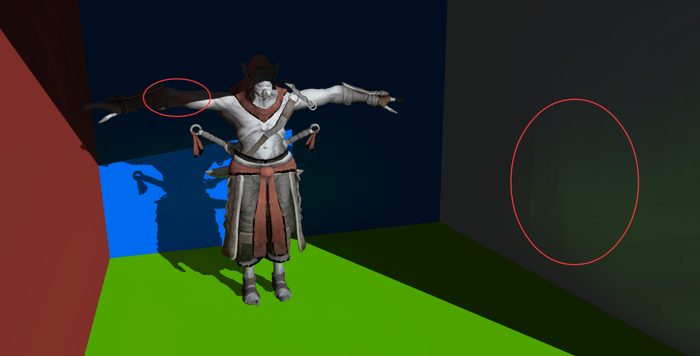

# 项目简介 &nbsp; Reflective_Shadow_Map
&nbsp;&nbsp;&nbsp;&nbsp;&nbsp;&nbsp;&nbsp;&nbsp;RSM虽然名字之中存在shadow一词，但事实上，其并非阴影算法，而是一种较为经典的全局光照GI(global illumination)算法，本文的RSM算法主要用于计算全局光照中的间接光照问题。直接光照较容易实现，但是一个好的间接光照可以大幅提升整体场景的渲染效果，通过模拟光线在场景中的弹射效果，可以实现场景中的某部分会受到周围环境中其他场景的的影响，进而使得整体环境更加逼真。

    
     
    
图1 只有直接光照

    
     
    
图2 直接光照 + 间接光照

# 具体实现
## GBufferPass
&nbsp;&nbsp;&nbsp;&nbsp;&nbsp;&nbsp;&nbsp;&nbsp;GBuffer是一differ shading中的一种思路，会将场景中所有的内容的世界坐标、法线、diffuse color等信息分别生成一张texture，以供后续渲染整个场景使用。（原文Monica大佬喜欢使用view space的坐标、法线等，我个人比较倾向世界坐标，理解二者之间的关系即可自行选择修改）。

## RSMBufferPass
&nbsp;&nbsp;&nbsp;&nbsp;&nbsp;&nbsp;&nbsp;&nbsp;后一步操作中，可以参考camera的参数通过构建光源的View和Projection矩阵，构建的u_LightVPMatrix在shader中和某个点的世界坐标相乘，便可以获得光源空间中的各种信息，该pass主要可以构建一个map，其中的每一个像素对应的位置都会作为虚拟点光源（VPL virtual point light）进行下一步的渲染。值得一提的是，代码中的VPL Map的分辨率代表着虚拟点光源的数量，提升分辨率可以提升渲染效果，但也会使得算法效率变低。

## ShadowMapPass
&nbsp;&nbsp;&nbsp;&nbsp;&nbsp;&nbsp;&nbsp;&nbsp;本步骤就是正常的Shadowmap，通过判断当前点在光源空间之中的深度值和光源深度图中该点对应像素的最小深度值之间的大小关系可生成硬阴影。添加阴影之后可以更加清晰地看到间接光照的作用。

## ShadingWithRSMPass
&nbsp;&nbsp;&nbsp;&nbsp;&nbsp;&nbsp;&nbsp;&nbsp;RSM具体原理如下图3，其中 _x_ 点为计算间接光照的点,而 _xp_ 则是VPL，也是为 _x_ 点提供间接光照的点。

    
     
    
图3 RSM基本原理

  
&nbsp;&nbsp;&nbsp;&nbsp;&nbsp;&nbsp;&nbsp;&nbsp; 而 _x_ 接收到的来自 _xp_ 的间接光照强度如下式：（该式子在games202中，闫老师曾对分母中的指数4提出疑问，最终发现没有问题的，取决于分子中两个cos函数中，两点之间的方向是否归一化，如果归一化则分母指数为2，反之则为4，ps：可惜没看到大佬吃键盘的直播）。而由于两个cos都经过了clamp（0，1），保证两个点之间的上半球空间中相互可见。
  
  

    
     
    
图4 RSM间接光照公式

 
&nbsp;&nbsp;&nbsp;&nbsp;&nbsp;&nbsp;&nbsp;&nbsp; 从上面可以看出来，VPL的方法就是先计算出VPL接收到的光照强度，然后再把这个VPL当成一个点光源来计算着色点的光照即可。然而，简单粗暴很可能意味着效率的低下，如果生成了一张分辨率较高的VPL Map， 那么我们在计算一个像素的着色的时候，我们需要遍历每个VPL，这效率太低了。为此，论文里假设了屏幕空间（注意，正确的应该是世界空间中，此处是一个trick）之中距离着色点越近的虚拟点光源权重便越大。设置了权重，越近权重越小（采样密度越大），而越远则权重越大（采样密度变小），如图5所示：
  
  

    
     
    
图5 RSM虚拟点光源采样分布图

 
&nbsp;&nbsp;&nbsp;&nbsp;&nbsp;&nbsp;&nbsp;&nbsp;采样公式可以表示为：
  
  

    
     
    
图6 RSM虚拟点光源采样分布公式

 
&nbsp;&nbsp;&nbsp;&nbsp;&nbsp;&nbsp;&nbsp;&nbsp;ξ1，ξ2为随机数（一组采样就需要一对随机数）代入上面的公式就可以得到一个采样坐标，然后再根据上面的光照计算公式来计算这个VPL对着色点的光照公式。注意：这种方法会有很大的误差，为了进行一些弥补，在每计算完一个虚拟点光源对着色点的光照之后应该再乘以权重 ξ12.在应用中我们通常会预计算一个采样图案，并重复使用这个采样图案来计算间接光源能够提供一个一致性，这种一致性减少了动态场景的闪烁情况。但如果采样点的数量不够大，这种空间一致性就容易产生带状伪影。

# RSM效果展示
&nbsp;&nbsp;&nbsp;&nbsp;&nbsp;&nbsp;&nbsp;&nbsp;最初使用了经典的sponza作为测试，调整后得到效果如图7：
  
  

    
     
    
图7 Sponza效果展示

 
&nbsp;&nbsp;&nbsp;&nbsp;&nbsp;&nbsp;&nbsp;&nbsp;由于算法效率确实很低，而且由于采样点数、rsm的分辨率不太高，效果也不太明显，于是更换场景为Cornellbox，如图8：
  
  

    
     
    
图8 CornellBox效果展示

 
&nbsp;&nbsp;&nbsp;&nbsp;&nbsp;&nbsp;&nbsp;&nbsp;最终调整了一些采样点数、采样半径等参数后，获得了最终较为自然的测试效果（GI的效果是自然的就好了，因为shadow、direct light shading等比较简陋hhh）。
  
  

    
     
    
图9 效果展示1

 
  
  

    
     
    
图10 效果展示2

 

# RSM总结与评价
&nbsp;&nbsp;&nbsp;&nbsp;&nbsp;&nbsp;&nbsp;&nbsp; RSM的原理确实较为简单，是一个简单粗暴的算法，但是其缺点也很明显：
* 光源数量过多，每个着色点都要遍历所有虚拟点光源，计算效率相当低。
* 算法忽略了Ambient occlusion，不可能为每一个虚拟点光源生成一个shadow map，忽略可见性就会导致不真实。
* 采样率不足就会导致效果变差，同时由于采样点的生成采用了根据屏幕空间距离而非世界空间距离进行权重采样的原因，难免产生不真实。
 
 
# 参考资料：
[1] Reflective Shadow Maps - Carsten Dachsbacher, Marc Stamminger
[2] Games202 - 高质量实时渲染-闫令琪
[3] 知乎：Monica的小甜甜：【论文复现】Reflective Shadow Maps
