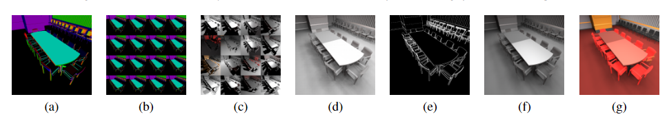
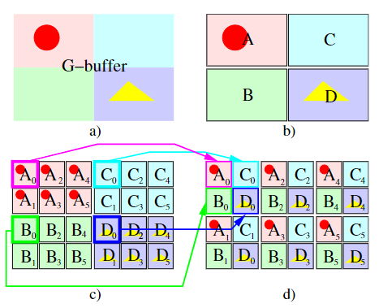
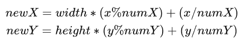
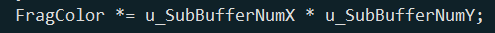
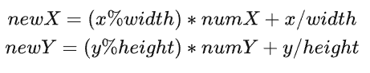
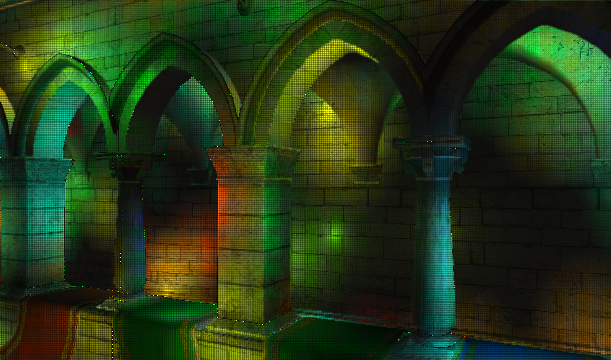
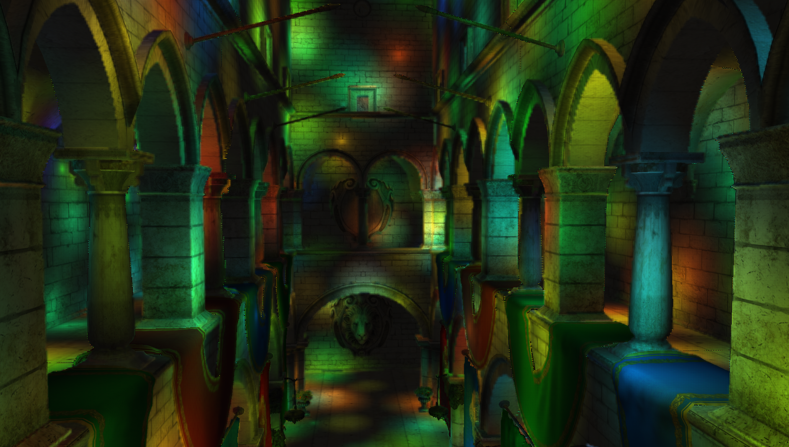
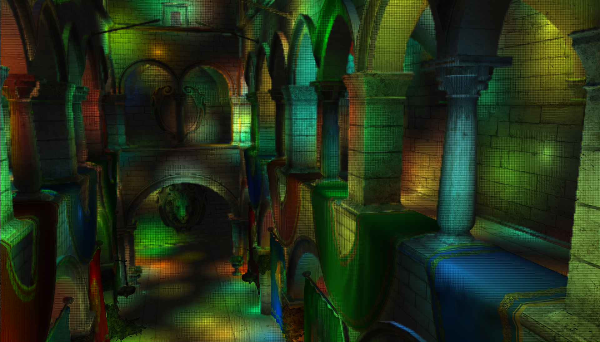

# 项目简介 &nbsp; Non interleaved Deferred Shading of Interleaved Sample Patterns
&nbsp;&nbsp;&nbsp;&nbsp;&nbsp;&nbsp;&nbsp;&nbsp;在01的RSM中，渲染整体场景的时候每个着色点需要遍历所有的VPL(virtual point light),这样一个过程的效率是相当低的，而本文则提供了一种非常实用的光照计算加速策略，本文的一大基础应用场景也是在计算大量VPL光照的加速。正如论文题目一样，本文的一大核心就是交错采样，可以简单的以解为将GBuffer中的各种信息进行分块重组，产生许多非常相似，但是分辨率较低的小场景，由于每个小场景也包含着相对完整的位置、法线、颜色和深度等信息，将光源也分为相同数量的分组，对每个小场景使用对应索引的光源分组进行光照渲染，最终将小场景计算得到的光照信息进行融合，形成最终的大场景光照渲染。算法步骤直接参考了原文的描述如图1。

 

图1 算法步骤

 
&nbsp;&nbsp;&nbsp;&nbsp;&nbsp;&nbsp;&nbsp;&nbsp;图1描述了整个算法的步骤，具体可以分解为：(a) 计算Gbuffer->(b) 分块（分成多个低分辨率小场景）->(c) 单独计算光照->(d) 组合(将计算完之后的小场景合并为一个大场景)->(e) 边缘检测（为了后面高斯模糊使用）->(f) 高斯模糊（后面会讲原因）->(g) 融合（讲纹理和光照结果进行相乘，如果在计算光照就把纹理带上，那么高斯模糊会讲纹理也一并模糊了）。(此段借用了Monica大佬的描述)

# 具体实现
## GBufferPass
&nbsp;&nbsp;&nbsp;&nbsp;&nbsp;&nbsp;&nbsp;&nbsp;GBuffer是一differ shading中的一种思路，会将场景中所有的内容的世界坐标、法线、diffuse color等信息分别生成一张texture，以供后续渲染整个场景使用。（原文Monica大佬喜欢使用view space的坐标、法线等，我个人比较倾向世界坐标，理解二者之间的关系即可自行选择修改）。

## EdgeDetectionPass
&nbsp;&nbsp;&nbsp;&nbsp;&nbsp;&nbsp;&nbsp;&nbsp;这个步骤主要通过临近像素对应的着色点的Viewspace的深度和normal来提取场景的的边缘，提取边缘的具体目的是在后续的高斯模糊中，判断该着色点是边缘，那么将不会对其进行模糊，使得整体边缘不会因为高斯模糊而失去锐度。然而，实现的渲染效果中边缘可能并不是特别理想，个人分析将会在效果展示处结合结果进行分析。

## SplitGBufferPass
&nbsp;&nbsp;&nbsp;&nbsp;&nbsp;&nbsp;&nbsp;&nbsp;这个步骤便是对Gbuffer的分割，这是本文较难理解的一个点，将参考图2进行解析,a)为第一个Pass中计算得到的GBuffer，包含了空间位置、法线、diffuse color等信息，首先需要将原图像进行分块，确定每一块的长和宽(m,n)，而原图像则会被划分为width/m * height/n 个图像块，将每张图像中相同位置的像素按照图像块的顺序排列，则会成为 width/m * height/n 张非常相似但是又略有不同的低分辨率Splited GBuffer。具体分块公式如图3

 

图2 分块策略 (Block Splitting)

 

 图3 分块公式

## ShadingOnSplitedGBufferPass
&nbsp;&nbsp;&nbsp;&nbsp;&nbsp;&nbsp;&nbsp;&nbsp; 计算分块的光照就和普通的计算一样，但是由于将所有的VPL均匀分给上一个步骤划分出的若干图像块，因此为了使整体亮度保持一致，需要将计算得到的光照乘以分块的数量，如图4（代码操作中使用的使4*4的图像块，也因此该数值为16）。虽然这样使用一个点收到的光，代表原图中其附近的点接受到的本组光源的贡献，难免会导致计算非常不准确，但是正如开头所述，尽管本文的测试场景是在Sponza中加入了非常多的随机点光源，但实际上是对VPL间接光照的计算，间接光照在整体场景中贡献不高，因此不准确问题也不大，近似表达即可。

 

 图4 光照补偿拟合

## GaussianBlurPass
&nbsp;&nbsp;&nbsp;&nbsp;&nbsp;&nbsp;&nbsp;&nbsp; 在完成了对若干低分辨率图像(还是存储为一张图像，如图3公式所示)进行渲染之后，我们需要对这些渲染效果进行融合，恢复我们原图预期的渲染效果，该步骤使用的公式如图5，可与图3可以结合理解，分别为融合公式和分块公式。

 

 图5 融合公式

## GaussianBlurPass
&nbsp;&nbsp;&nbsp;&nbsp;&nbsp;&nbsp;&nbsp;&nbsp; 由于融合后，每一块中的4*4个像素每个都完全由不同组的VPL贡献其色彩，为了近似这一块由所有VPL均匀贡献，需要对画面进行一次高斯模糊，值得一提的是，高斯模糊原本是对每一个点由其周围一个区域的所有像素贡献，可以通过横向和纵向两次模糊以较快的速度实现相同的效果。（在本Pass中并没有加上着色点的diffuse color，因为我们需要的是对光照效果进行模糊，如果加上纹理色彩，则纹理也会被模糊掉，这不是我们想要的，最终在一个screen quad pass中加上即可。）

# 效果展示
&nbsp;&nbsp;&nbsp;&nbsp;&nbsp;&nbsp;&nbsp;&nbsp;最初使用了经典的sponza作为测试，调整后得到效果如图6：
  

 

图6 Sponza效果展示1

 
&nbsp;&nbsp;&nbsp;&nbsp;&nbsp;&nbsp;&nbsp;&nbsp;此处分析我为何认为本项目中边缘处理策略不是最佳的,如图7，可以发现在一些边缘处，出现了一条杂乱色彩的线条，这是由于在交错采样的过程中，边缘也被分割，也在对应的图像块中，由一组单独的光源进行照亮，而边缘线上连续两个像素则可能完全由不同的光源组进行照亮，这是会产生非常难看的杂乱色彩线条。

  

 

图7 Sponza效果展示2

&nbsp;&nbsp;&nbsp;&nbsp;&nbsp;&nbsp;&nbsp;&nbsp;去除掉边缘检测的作用之后，对全图进行模糊后得到图8，可以看到边缘也确实失去了其应有的锐度，而我个人也没有想到较好的处理边缘的策略，如果看到这个的你有什么想法，请务必联系我哦！！

  

 

图8 Sponza效果展示(无边缘处理)

# 总结与评价
&nbsp;&nbsp;&nbsp;&nbsp;&nbsp;&nbsp;&nbsp;&nbsp; 本文的策略非常聪明，也有非常广泛的应用场景，计算时间减少了 numX * numY 倍，也获得了近似的效果，这个思路在处理VPL的间接光照或者大量光照下的环境的时候非常有效，且理论上误差肉眼可以接受，在处理非环境主要着色的时候是非常厉害的策略，但其也存在一些缺点。
* 更加适用于间接光照，如果用于计算场景的主要光照，那么边缘则很难在保留其锐度的前提下得到较好的效果。
* 仔细观看图8的地板，由于分块处理像素，尽管做了高斯模糊，仍然会保留一定的像素色差，这一点可以通过多次模糊或者更高的模糊策略进行改善。。
 
 
# 参考资料：

[1] Segovia, B. & Iehl, J. & Mitanchey, Richard & Péroche, B.. (2006). Non-interleaved deferred shading of interleaved sample patterns. 53-60. 10.1145/1283900.1283909.  
[2] 知乎：Monica的小甜甜：【论文复现】Non interleaved Deferred Shading of Interleaved Sample Patterns
