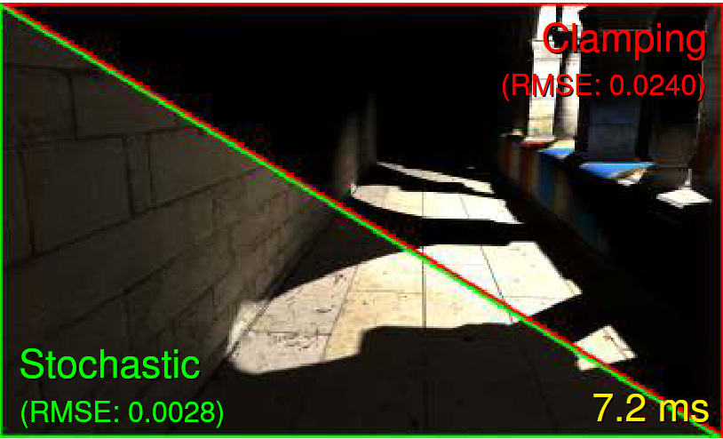
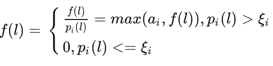
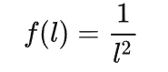
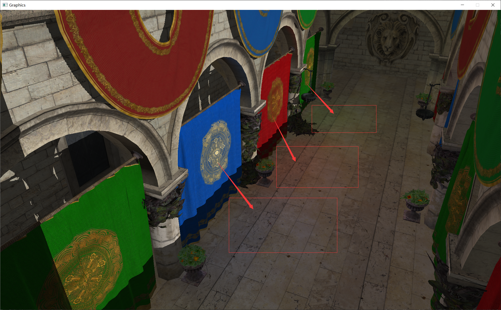
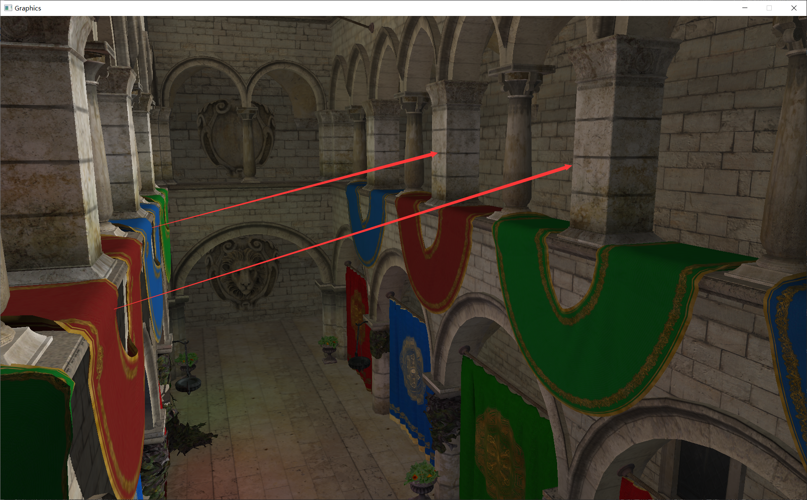

# 项目简介 &nbsp; 随机光源裁剪 SLC (Stochastic Light Culling)
&nbsp;&nbsp;&nbsp;&nbsp;&nbsp;&nbsp;&nbsp;&nbsp;在01的RSM中，渲染整体场景的时候每个着色点需要遍历所有的VPL(virtual point light),在02中，通过交错采样来实现了计算VPL影响的加速。然而还有一个问题尚未解决，不管是遍历还是交错采样，我们都没有考虑忽略距离当前计算着色点较远（贡献值很低）以进行加速。在本文的SLC中提出了一个非常自然的光源裁剪策略，其包含着对于光源影响半径的判断和随机光源裁剪两层裁剪，可以实现加速计算的同时保持间接光照的自然效果。

 

图1 SLC VS Clamping

&nbsp;&nbsp;&nbsp;&nbsp;&nbsp;&nbsp;&nbsp;&nbsp;请观察图1（论文原图），虽然像素不是很高，但是能明显看到二者的差异，右上的 Clamping 根据VPL到着色点的空间距离直接进行阶段，可以发现尽管间接光照的影响范围可以由VPL的影响半径调节，但是光照的衰减是突变的，从亮部到暗部的过渡很快，这难免会有些不自然，而左下的随机光源裁剪，亮部到暗部的过度是很自然的渐变效果，看起来非常逼真。

# 具体实现
## GBufferPass
&nbsp;&nbsp;&nbsp;&nbsp;&nbsp;&nbsp;&nbsp;&nbsp;GBuffer是一differ shading中的一种思路，会将场景中所有的内容的世界坐标、法线、diffuse color等信息分别生成一张texture，以供后续渲染整个场景使用。（原文Monica大佬喜欢使用view space的坐标、法线等，我个人比较倾向世界坐标，理解二者之间的关系即可自行选择修改）。

## RSMBufferPass
&nbsp;&nbsp;&nbsp;&nbsp;&nbsp;&nbsp;&nbsp;&nbsp;后一步操作中，可以参考camera的参数通过构建光源的View和Projection矩阵，构建的u_LightVPMatrix在shader中和某个点的世界坐标相乘，便可以获得光源空间中的各种信息，该pass主要可以构建一个map，其中的每一个像素对应的位置都会作为虚拟点光源（VPL virtual point light）进行下一步的渲染。值得一提的是，代码中的VPL Map的分辨率代表着虚拟点光源的数量，提升分辨率可以提升渲染效果，但也会使得算法效率变低。

## ShadowMapPass
&nbsp;&nbsp;&nbsp;&nbsp;&nbsp;&nbsp;&nbsp;&nbsp;本步骤就是正常的Shadowmap，通过判断当前点在光源空间之中的深度值和光源深度图中该点对应像素的最小深度值之间的大小关系可生成硬阴影。添加阴影之后可以更加清晰地看到间接光照的作用。

## CalculateVPLRadiusPass
&nbsp;&nbsp;&nbsp;&nbsp;&nbsp;&nbsp;&nbsp;&nbsp;

## ShadingWithRSMPass
&nbsp;&nbsp;&nbsp;&nbsp;&nbsp;&nbsp;&nbsp;&nbsp;RSM具体原理如下图3，其中 _x_ 点为计算间接光照的点,而 _xp_ 则是VPL，也是为 _x_ 点提供间接光照的点。

 图4 光照补偿拟合

## GaussianBlurPass
&nbsp;&nbsp;&nbsp;&nbsp;&nbsp;&nbsp;&nbsp;&nbsp; 在完成了对若干低分辨率图像(还是存储为一张图像，如图3公式所示)进行渲染之后，我们需要对这些渲染效果进行融合，恢复我们原图预期的渲染效果，该步骤使用的公式如图5，可与图3可以结合理解，分别为融合公式和分块公式。

 

 图5 融合公式

## GaussianBlurPass
&nbsp;&nbsp;&nbsp;&nbsp;&nbsp;&nbsp;&nbsp;&nbsp; 由于融合后，每一块中的4*4个像素每个都完全由不同组的VPL贡献其色彩，为了近似这一块由所有VPL均匀贡献，需要对画面进行一次高斯模糊，值得一提的是，高斯模糊原本是对每一个点由其周围一个区域的所有像素贡献，可以通过横向和纵向两次模糊以较快的速度实现相同的效果。（在本Pass中并没有加上着色点的diffuse color，因为我们需要的是对光照效果进行模糊，如果加上纹理色彩，则纹理也会被模糊掉，这不是我们想要的，最终在一个screen quad pass中加上即可。）

# 效果展示
&nbsp;&nbsp;&nbsp;&nbsp;&nbsp;&nbsp;&nbsp;&nbsp;最初使用了经典的sponza作为测试，调整后得到效果如图6：
  

 

图6 Sponza效果展示1

 
&nbsp;&nbsp;&nbsp;&nbsp;&nbsp;&nbsp;&nbsp;&nbsp;此处分析我为何认为本项目中边缘处理策略不是最佳的,如图7，可以发现在一些边缘处，出现了一条杂乱色彩的线条，这是由于在交错采样的过程中，边缘也被分割，也在对应的图像块中，由一组单独的光源进行照亮，而边缘线上连续两个像素则可能完全由不同的光源组进行照亮，这是会产生非常难看的杂乱色彩线条。

  

 

图7 Sponza效果展示2

&nbsp;&nbsp;&nbsp;&nbsp;&nbsp;&nbsp;&nbsp;&nbsp;去除掉边缘检测的作用之后，对全图进行模糊后得到图8，可以看到边缘也确实失去了其应有的锐度，而我个人也没有想到较好的处理边缘的策略，如果看到这个的你有什么想法，请务必联系我哦！！

  

 

图8 Sponza效果展示(无边缘处理)

# 总结与评价
&nbsp;&nbsp;&nbsp;&nbsp;&nbsp;&nbsp;&nbsp;&nbsp; 本文的策略非常聪明，也有非常广泛的应用场景，计算时间减少了 numX * numY 倍，也获得了近似的效果，这个思路在处理VPL的间接光照或者大量光照下的环境的时候非常有效，且理论上误差肉眼可以接受，在处理非环境主要着色的时候是非常厉害的策略，但其也存在一些缺点。
* 更加适用于间接光照，如果用于计算场景的主要光照，那么边缘则很难在保留其锐度的前提下得到较好的效果。
* 仔细观看图8的地板，由于分块处理像素，尽管做了高斯模糊，仍然会保留一定的像素色差，这一点可以通过多次模糊或者更高的模糊策略进行改善。。
 
 
# 参考资料：

[1] Segovia, B. & Iehl, J. & Mitanchey, Richard & Péroche, B.. (2006). Non-interleaved deferred shading of interleaved sample patterns. 53-60. 10.1145/1283900.1283909.  
[2] 知乎：Monica的小甜甜：【论文复现】Non interleaved Deferred Shading of Interleaved Sample Patterns
