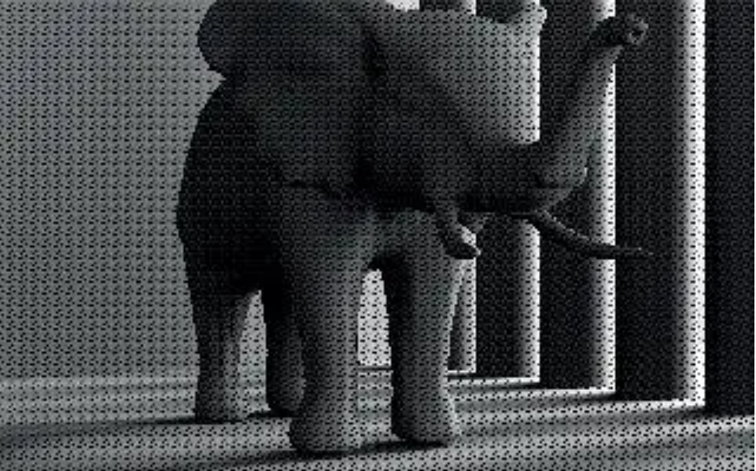
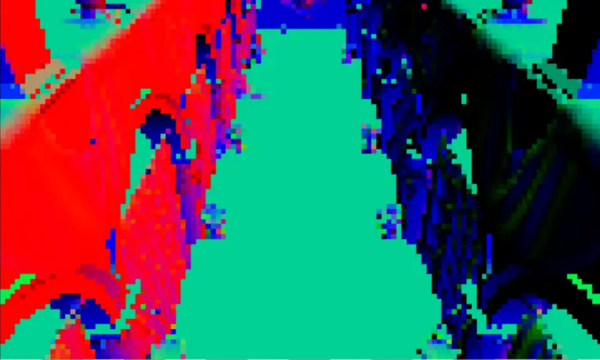
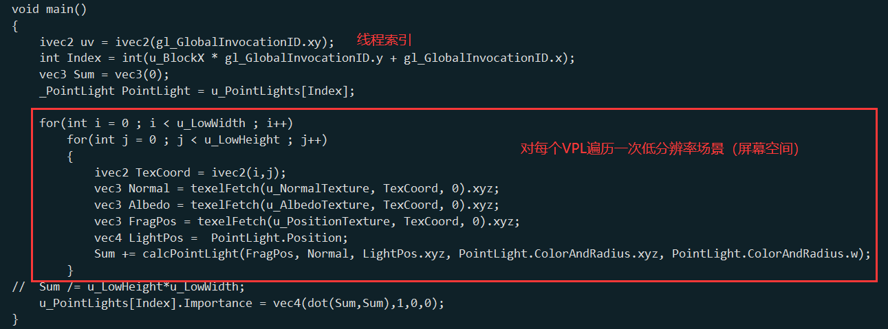
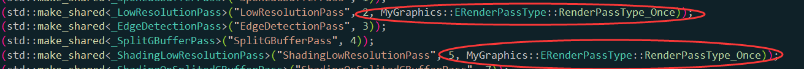

# 项目简介 &nbsp; Metalights : Improved Interleaved Shading
&nbsp;&nbsp;&nbsp;&nbsp;&nbsp;&nbsp;&nbsp;&nbsp;正如标题所示，本文是在02 交错采样的基础上进行了改进策略，主要将多光源VPL分组进行优化，本文的改进效果可能肉眼并不明显，但是优化思路很有参考价值，由于本文我个人修改很少，主要学习思路，所以README中会引用许多Monica大佬的讲解，也许能够帮助你理解本文算法。

&nbsp;&nbsp;&nbsp;&nbsp;&nbsp;&nbsp;&nbsp;&nbsp;论文中描述了改进内容和效果，如图 1 和图 2所示，在02中我们已经发现了即使存在高斯模糊的Pass以拟合每一个分块中的像素接收到系统中的所有的VPL的贡献，但是仍然会出现像素之间存在色差从而导致结果中肉眼可见一些像素分块，而论文则是针对这一问题，利用对灯光进行排序进行改进。

 

图1 交错采样效果

 

图2 改进后的交错采样效果

# 具体实现

本文和02的Pass结构较为相似，本处只介绍改进的策略和对应的Pass

## LowResolutionPass
&nbsp;&nbsp;&nbsp;&nbsp;&nbsp;&nbsp;&nbsp;&nbsp;论文中观察到在02中，我们对图像进行分块重组，而对于众多的VPL，按照编号顺序进行分组，分组数量和图像分组数量一致，按照编号直接进行分组的算法，可能存在部分光源对场景贡献比较大的分在了同一组，而相邻的组分配到的光源对场景的贡献度非常小，那么这两个组中，属于原图中相邻的着色点计算出的颜色就会出现明显色差，也就出现了像素色差。

&nbsp;&nbsp;&nbsp;&nbsp;&nbsp;&nbsp;&nbsp;&nbsp;本文的优化策略简而言之就是不在根据编号分组，而是根据VPL对场景的贡献度进行分组。可能会疑惑，计算场景贡献度不久需要渲染一边整体场景吗？这就是本文的一个很巧妙的Trick，本文最初会生成一次低分辨率的场景，根据最初生成的Gbuffer的信息，将他们进行低分辨率采样，构建一个新的低分辨率的场景，这个场景将会应用于计算每个VPL对整体的贡献度。

 

图3 低分辨率场景

## ShadingLowResolutionPass
&nbsp;&nbsp;&nbsp;&nbsp;&nbsp;&nbsp;&nbsp;&nbsp;这里Monica大佬在实现的时候，用了一个我觉得挺有意思的Trick，这里使用的Compute Shader中利用计算着色器的并行计算能力，每条线程计算一个VPL对低分辨率场景的贡献度，具体代码如图4所示：

 

图4 并行计算每个VPL对场景贡献度的Trick

&nbsp;&nbsp;&nbsp;&nbsp;&nbsp;&nbsp;&nbsp;&nbsp;本文的思路就是在这个Pass之后，我们获得了每个VPL的场景贡献度，后续会依据贡献度进行排序，排序后分组方式为：第一组的光源由贡献度排序后的1、1+n，1+2n …… , 其中n为 NumLights/NumBlocks。

 

__！！！！！！然而这里有一个问题，也直接导致了Monica大佬复现的时候优化效果不佳！！！！！！！__

 

 

图5 上述两个Pass的设置

&nbsp;&nbsp;&nbsp;&nbsp;&nbsp;&nbsp;&nbsp;&nbsp;图 5 中的两个设置的意思是，这个Pass只会update一次，这在代码中的意思是，整个渲染之中，只会构建一次低分辨率场景，并根据这一张场景中并行计算VPL的场景贡献度，并根据贡献度进行排序，这样子理论上会使得交错采样得到的场景更加均匀，会显著改善相邻像素存在色差的问题。

&nbsp;&nbsp;&nbsp;&nbsp;&nbsp;&nbsp;&nbsp;&nbsp;然而，这个方法存在一个显著的问题：这一次排序，依据的是第一帧的屏幕空间中每个着色点与VPL的位置关系，这并不是VPL与场景的全部元素之间的关系，这也就使得，计算出的排序结果，也是最适用于第一帧。然而代码实现的是，第一帧计算出的VPL排序关系将会直接应用到后续所有的渲染之中，这显然是无道理的。这也是为什么Monica大佬在知乎中这篇论文的复现中提到实际实现改进效果不明显的原因。

# 总结与评价
&nbsp;&nbsp;&nbsp;&nbsp;&nbsp;&nbsp;&nbsp;&nbsp; 本文发掘了排序算法在渲染中的一种应用可能性，尽管对于每一帧都渲染一次低分辨率场景并分别进行一次贡献度计算与排序显然在实时渲染之中是不现实的，但是这种算法仍然具备非常好的参考价值和指导意义。

 
 

# 参考资料：

[1] Metalights : Improved Interleaved Shading
September 2010Computer Graphics Forum 29(7):2109-2117
DOI:10.1111/j.1467-8659.2010.01798.x
SourceDBLP   
[2] 知乎：Monica的小甜甜：【论文复现】Metalights : Improved Interleaved Shading
