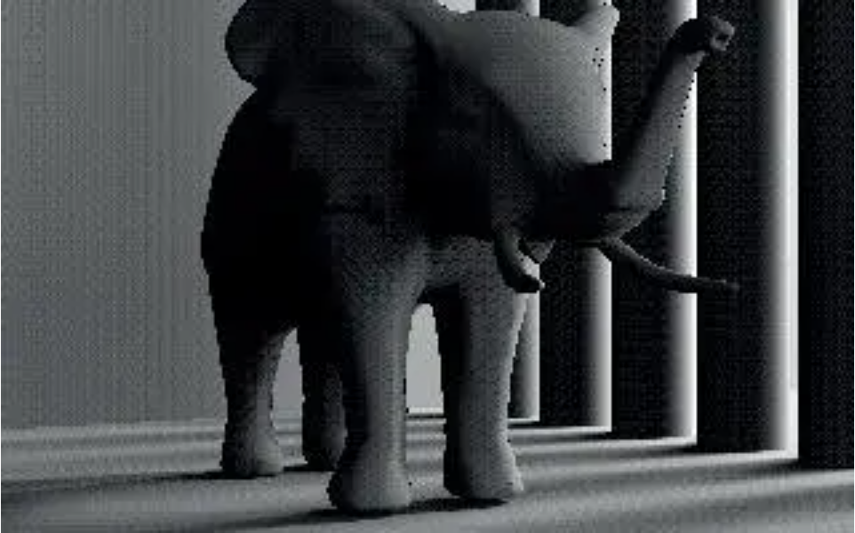

# 项目简介 &nbsp; Metalights : Improved Interleaved Shading
&nbsp;&nbsp;&nbsp;&nbsp;&nbsp;&nbsp;&nbsp;&nbsp;正如标题所示，本文是在02 交错采样的基础上进行了改进策略，主要将多光源VPL分组进行优化，本文的改进效果可能肉眼并不明显，但是优化思路很有参考价值，由于本文我个人修改很少，主要学习思路，所以README中会引用许多Monica大佬的讲解，也许能够帮助你理解本文算法。

&nbsp;&nbsp;&nbsp;&nbsp;&nbsp;&nbsp;&nbsp;&nbsp;论文中描述了改进内容和效果，如图 1 和图 2所示，在02中我们已经发现了即使存在 

 

图1 交错采样效果

 

图2 改进后的交错采样效果

&nbsp;&nbsp;&nbsp;&nbsp;&nbsp;&nbsp;&nbsp;&nbsp;请观察图1（论文原图），虽然像素不是很高，但是能明显看到二者的差异，右上的 Clamping 根据VPL到着色点的空间距离直接进行阶段，可以发现尽管间接光照的影响范围可以由VPL的影响半径调节，但是光照的衰减是突变的，从亮部到暗部的过渡很快，这难免会有些不自然，而左下的随机光源裁剪，亮部到暗部的过度是很自然的渐变效果，看起来非常逼真。

# 具体实现
## GBufferPass
&nbsp;&nbsp;&nbsp;&nbsp;&nbsp;&nbsp;&nbsp;&nbsp;GBuffer是一differ shading中的一种思路，会将场景中所有的内容的世界坐标、法线、diffuse color等信息分别生成一张texture，以供后续渲染整个场景使用。（原文Monica大佬喜欢使用view space的坐标、法线等，我个人比较倾向世界坐标，理解二者之间的关系即可自行选择修改）。

## RSMBufferPass
&nbsp;&nbsp;&nbsp;&nbsp;&nbsp;&nbsp;&nbsp;&nbsp;后一步操作中，可以参考camera的参数通过构建光源的View和Projection矩阵，构建的u_LightVPMatrix在shader中和某个点的世界坐标相乘，便可以获得光源空间中的各种信息，该pass主要可以构建一个map，其中的每一个像素对应的位置都会作为虚拟点光源（VPL virtual point light）进行下一步的渲染。值得一提的是，代码中的VPL Map的分辨率代表着虚拟点光源的数量，提升分辨率可以提升渲染效果，但也会使得算法效率变低。

## ShadowMapPass
&nbsp;&nbsp;&nbsp;&nbsp;&nbsp;&nbsp;&nbsp;&nbsp;本步骤就是正常的Shadowmap，通过判断当前点在光源空间之中的深度值和光源深度图中该点对应像素的最小深度值之间的大小关系可生成硬阴影。添加阴影之后可以更加清晰地看到间接光照的作用。

## CalculateVPLRadiusPass
&nbsp;&nbsp;&nbsp;&nbsp;&nbsp;&nbsp;&nbsp;&nbsp;实际上前边的几个pass都和RSM类似，而这个pass则是本文的精髓，这个步骤室使用Compute Shader计算得到每个VPL的裁剪参数。首先我们需要知道为了实现裁剪我们需要哪些参数，从基础着色公式来看：

 图2 VPL基础着色公式

&nbsp;&nbsp;&nbsp;&nbsp;&nbsp;&nbsp;&nbsp;&nbsp;其中 I 为 VPLi 在 - wi 方向上的光照强度, _f_ (|| _xi - x_ || ) 函数则是 VPLi 到点 _x_ 点的衰减函数，一般而言，衰减函数与两点之间的距离成反比：

 图3 光照衰减函数

&nbsp;&nbsp;&nbsp;&nbsp;&nbsp;&nbsp;&nbsp;&nbsp;实际上这个衰减函数在计算间接光照的时候存在一些问题，首先就是这个衰减函数是永远不等于0的，这样对于距离很远的点也仍然需要计算虚拟点光源的贡献，这也牵扯出后续光源裁剪策略；另外，由于这个衰减函数没有考虑到距离过近的时候出现的计算错误，在Monica大佬的源码中我发现存在如图4的突兀光斑，导致渲染效果较差。

 图4 衰减函数引起的光斑问题

&nbsp;&nbsp;&nbsp;&nbsp;&nbsp;&nbsp;&nbsp;&nbsp; 经过分析，这是由于距离过近的时候，平方反比的衰减函数并不能正确计算近处的光照问题，将衰减函数增加一个低阈值阶段修改为 _float Fil = 1.0f / max(SquareDistance,0.1);_ 则可以较好地解决该问题，具体可以参考最终结果，不再有突兀的光斑了。

 
&nbsp;&nbsp;&nbsp;&nbsp;&nbsp;&nbsp;&nbsp;&nbsp; 接下来需要介绍光源裁剪思路：每个光源设定一个随机数，然后对光源进行一个随机裁剪即可。思路很简单，不过如果真的是每个光源被裁剪的概率相等的话，那么还是会有可能对光照贡献大的光源被裁剪了。因此作者给出了一个新的衰减公式如下：

 图5 裁剪修正后的衰减函数

&nbsp;&nbsp;&nbsp;&nbsp;&nbsp;&nbsp;&nbsp;&nbsp; _ai_ 是VPL的一个参数，也是这个pass中需要记录为texture的一个参数，而 _ξi_ 则是第 _i_ 个VPL对应的随机数，这个可以在初始化的过程中为每个光源随机分配一个 0~1 之间的随机数。其中的 _pi (l)_ 则是：

 图6 _pi (l)_ 计算公式

&nbsp;&nbsp;&nbsp;&nbsp;&nbsp;&nbsp;&nbsp;&nbsp;而论文中推导出了一个截断半径的推导公式，半径可以作为第一个截断函数，当两点在世界坐标系中的距离大于影响半径的时候，则直接可以忽略该VPL对该着色点的贡献。

 图7 截断半径计算公式

&nbsp;&nbsp;&nbsp;&nbsp;&nbsp;&nbsp;&nbsp;&nbsp;可以看到我们前边几乎所有的公式中都存在一个 _ai_ 的参数，这是一个和误差有关的常数：

 图8 _ai_ 计算公式

&nbsp;&nbsp;&nbsp;&nbsp;&nbsp;&nbsp;&nbsp;&nbsp;其中 emax与误差有关，原论文中使用值为 _0.0005f_ , _E_ 为相机的曝光度，最终就可以代入数据实现论文的效果，这篇论文公式给的很全，是比较好复现的论文，思路比较巧妙。

## ShadingWithRSMPass
&nbsp;&nbsp;&nbsp;&nbsp;&nbsp;&nbsp;&nbsp;&nbsp;RSM具体原理已经介绍过，在具体实现本文的过程中，光源裁剪实际上是在这个Pass中实现的，而上一个Pass更多的是记录了 _ai_ 和截断半径 _r_ ，而具体的如图5和图6的公式则是在这个Pass中实现的。

# 效果展示
&nbsp;&nbsp;&nbsp;&nbsp;&nbsp;&nbsp;&nbsp;&nbsp;最初使用了经典的sponza作为测试，调整后得到效果如图6，在未被光照到的地面也反射出了帘子的颜色，而且相对自然：
  

 

图9 Sponza效果展示1

&nbsp;&nbsp;&nbsp;&nbsp;&nbsp;&nbsp;&nbsp;&nbsp;在直接光照照到的左侧对面，可以看到锦的色彩也同样反射到了对面，尽管距离较远存在衰减，但是还是能够分辨出来自锦的间接光照，这个效果比预期要更好哈哈。

 

图10 Sponza效果展示2

&nbsp;&nbsp;&nbsp;&nbsp;&nbsp;&nbsp;&nbsp;&nbsp;通过观察对侧的墙面，对比左侧没有被直接光照照到的部分（几乎全黑），右侧的墙面完全是由间接光照照亮的，效果还是可以的。

 

图11 Sponza效果展示3

# 总结与评价
&nbsp;&nbsp;&nbsp;&nbsp;&nbsp;&nbsp;&nbsp;&nbsp; 本文对于VPL的间接光照的实现效果不错的同时，还显著提高了VPL计算的效率，在01RSM中，RSM的分辨率只有256 * 256 , 而本文的RSM分辨率为 1024 * 1024, 但在光源裁剪的策略下，没有使用02的交错采样的策略便都能在更复杂的场景Sponza中获得更高的帧率，加速效果还是十分显著的。

 
 
# 参考资料：

[1] Tokuyoshi, Yusuke & Harada, Takahiro. (2017). Stochastic Light Culling for VPLs on GGX Microsurfaces. Computer Graphics Forum. 36. 55-63. 10.1111/cgf.13224.   
[2] 知乎：Monica的小甜甜：【论文复现】Stochastic Light Culling
