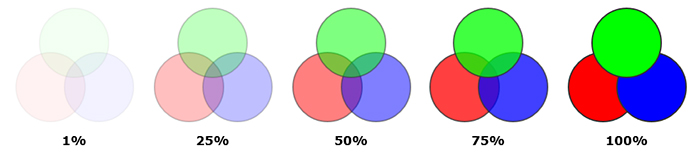
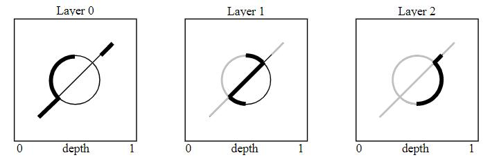
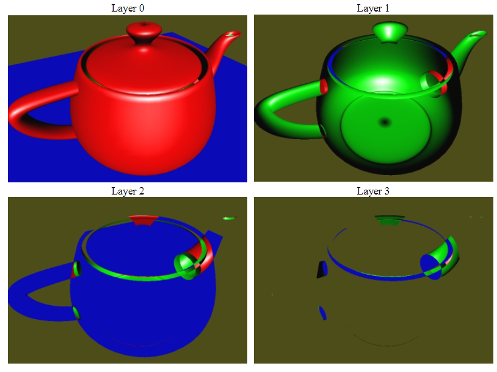
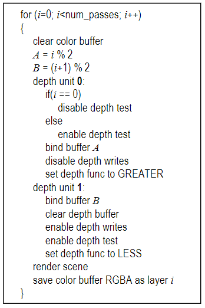
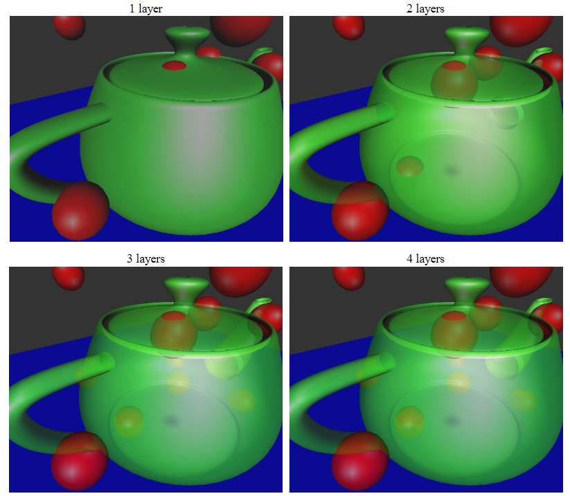
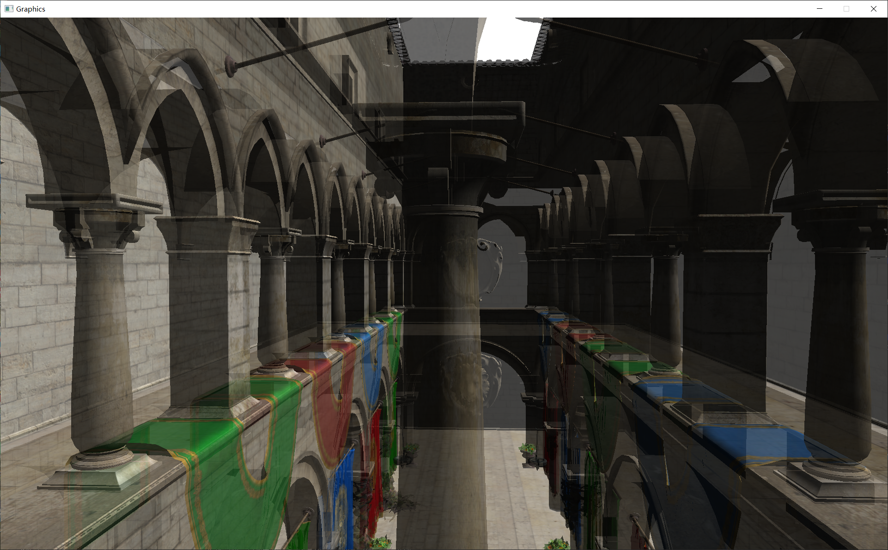
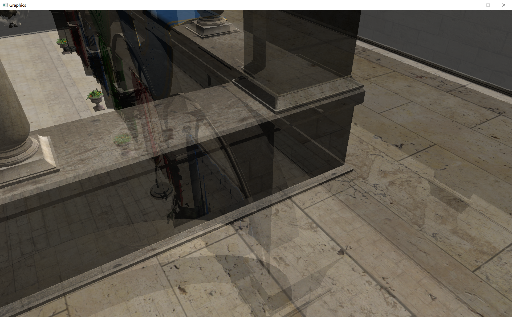
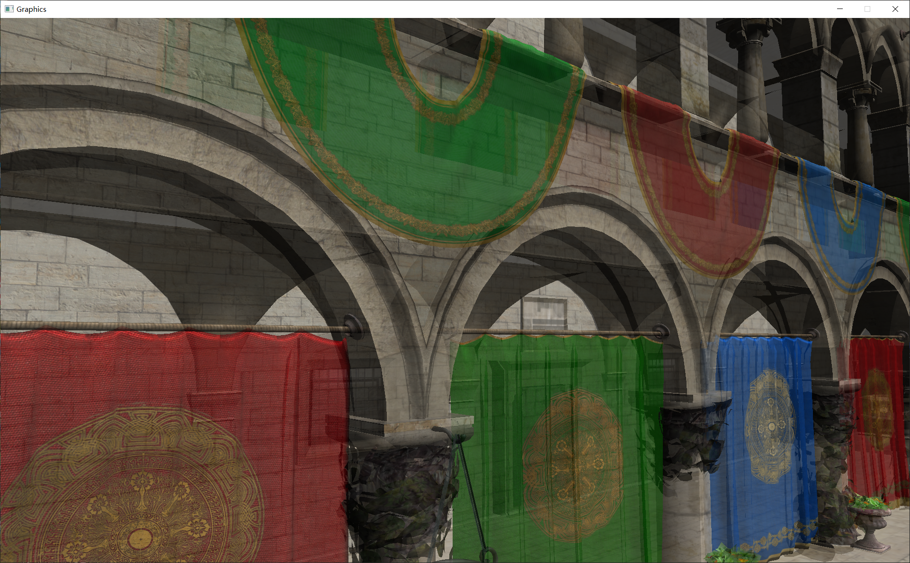

# 项目简介 &nbsp; Interactive order-independent transparency
&nbsp;&nbsp;&nbsp;&nbsp;&nbsp;&nbsp;&nbsp;&nbsp;本项目是非常经典的顺序无关的混合算法，主要原理便是深度剥离，设置多个帧缓存，每一个帧缓存渲染的时候将会剥离前一张缓存中相同深度或深度更小的内容。如此，每次渲染越来越深入，通过融合shader将相邻帧缓存进行融合即可。图 1 主要展示了经典的透明物体融合策略：

__(_Cdst = Asrc Csrc + (1 - Asrc) Cdst_)__

 

图1 经典透明物体融合方法

# 具体实现
## DepthPeellingPass
&nbsp;&nbsp;&nbsp;&nbsp;&nbsp;&nbsp;&nbsp;&nbsp;深度剔除的思路正如前文所说，每次次渲染都需要剔除距离相机较近的场景，正如图2所示：

 图2 深度剔除策略（相机从左向右看）

&nbsp;&nbsp;&nbsp;&nbsp;&nbsp;&nbsp;&nbsp;&nbsp;本文的算法并不难以理解，重点是这个Pass的实现过程中作者大佬用了一个很有趣的策略，也让我在opengl和glsl的学习上又学到了一些新东西：

&nbsp;&nbsp;&nbsp;&nbsp;&nbsp;&nbsp;&nbsp;&nbsp;首先在论文中，作者使用了4个layer进行深度剔除，每层渲染的内容如图3所示。为了实现这个，理论上需要四张帧缓存进行存储每一帧计算得到的内容，然而这正是这种算法的缺点所在，这会比较吃显存，对于PC端可能还可以接受，但是在移动端想要如此挥霍显存是不切实际的。

 图3 4个layer每层渲染的内容

&nbsp;&nbsp;&nbsp;&nbsp;&nbsp;&nbsp;&nbsp;&nbsp;为了在一定程度上节约显存，作者在原文中提出了一种策略：使用两张帧缓存，不断进行深度推进，每次将两张帧缓存进行融合存储到缓存A中，并继续计算缓存B并继续融合。这样只需要两张帧缓存实现算法， 尽管每个Layer还是需要计算一次，复杂度上并没有得到改善，但是空间使用上则会得到较好的改善。这一过程在论文中的伪代码如图 4：

 图4 帧缓存优化伪代码

&nbsp;&nbsp;&nbsp;&nbsp;&nbsp;&nbsp;&nbsp;&nbsp;具体实现过程中，则是由以下两行代码进行调度
* glBindFramebuffer(GL_FRAMEBUFFER, m_FBO[i % 2]);&nbsp;&nbsp;&nbsp;&nbsp;&nbsp;&nbsp;&nbsp;&nbsp;//按照 [0, 1, 0, 1]的顺序generate depth map
* m_pShader->setTextureUniformValue("u_DepthTexture", m_TextureDepth[(i - 1) % 2]);&nbsp;&nbsp;&nbsp;&nbsp;&nbsp;&nbsp;&nbsp;&nbsp;//按照[#， 0， 1， 0]的顺序读取 depth map 用于cull surface

 

&nbsp;&nbsp;&nbsp;&nbsp;&nbsp;&nbsp;&nbsp;&nbsp;深度剔除则是使用discard进行，深度贴图也会跳过该点，计算其后的深度存储到贴图中。
* if(gl_FragCoord.z <= (texture(u_DepthTexture,deptc).r) + Bias)
   			
&nbsp;&nbsp;&nbsp;&nbsp;&nbsp;&nbsp;&nbsp;&nbsp;&nbsp;&nbsp;&nbsp;&nbsp;&nbsp;&nbsp;&nbsp;&nbsp;discard ;

 

&nbsp;&nbsp;&nbsp;&nbsp;&nbsp;&nbsp;&nbsp;&nbsp;至于融合，也是使用类似图1的融合策略进行融合即可：
* Color_ = vec4(texture(u_BlendTexture,v2f_TexCoords).rgb * u_BlendFactor 

&nbsp;&nbsp;&nbsp;&nbsp;&nbsp;&nbsp;&nbsp;&nbsp;&nbsp;&nbsp;&nbsp;&nbsp;&nbsp;&nbsp;&nbsp;&nbsp;
+(1 - u_BlendFactor) * texture(u_ColorTexture,v2f_TexCoords).rgb , 1) ; 

 图5 论文效果

# 效果展示
&nbsp;&nbsp;&nbsp;&nbsp;&nbsp;&nbsp;&nbsp;&nbsp;使用了经典的sponza作为测试，调整后得到效果如图6，这种透明效果还是很自然的：
  

 

图9 Sponza效果展示1

 

图10 Sponza效果展示2

 

图11 Sponza效果展示3

# 总结与评价
&nbsp;&nbsp;&nbsp;&nbsp;&nbsp;&nbsp;&nbsp;&nbsp; 本文的透明效果还是比较自然的，然而，由于本文涉及到多次场景的渲染，每一帧的渲染需要正常渲染的数倍时间，和内存（尽管空间复杂度已经得到改善），这个在实际开发中是无法接受的，仅可作为启发性参考算法。

 
 
# 参考资料：

[1] Everitt, Cass W.. “Interactive Order-Independent Transparency.” (2001)..   
[2] 知乎：Monica的小甜甜：【论文复现】Interactive Order Independent Transparency
