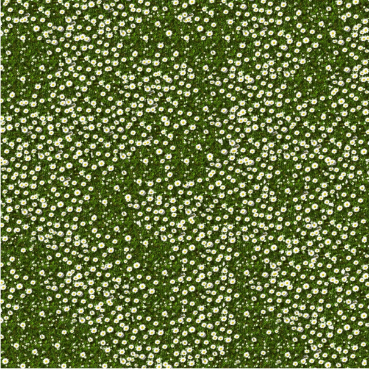
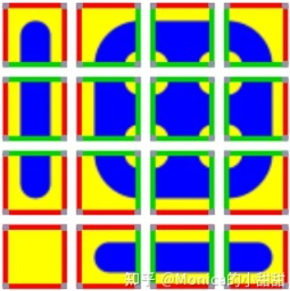
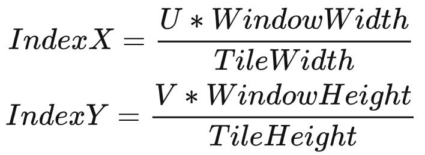
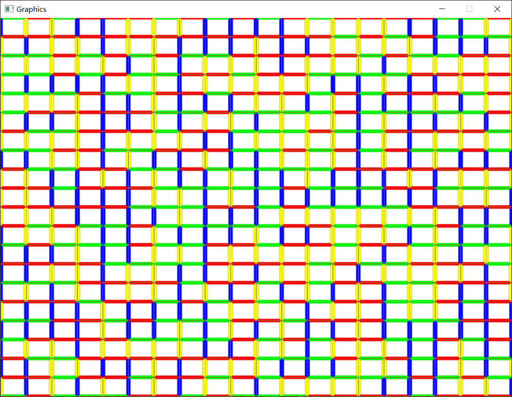

# 项目简介 &nbsp; Wang Tiles for Image and Texture Generation
&nbsp;&nbsp;&nbsp;&nbsp;&nbsp;&nbsp;&nbsp;&nbsp;本文是一种纹理生成算法，在图形学中需要生成一些贴图内部相似，但是整体纹理较大的贴图，此时有一种方法就是使用非常小块的贴图重复生成一整张贴图，但是效果会非常差，这篇论文则是提出了一种，使用若干小贴图，通过判断每个小贴图的边缘之间的过渡关系来随机生成不重复的大贴图，论文中生成的效果如图1所示：

 

图1 论文生成效果

&nbsp;&nbsp;&nbsp;&nbsp;&nbsp;&nbsp;&nbsp;&nbsp;论文的方法很巧妙，一个小贴图的四个边缘赋予一个性质，论文中使用的颜色，如果两张贴图的边缘可以拼在一起，那么就给他们赋予同一种颜色，准备好一定数量的可以拼在一起的小纹理后，便可以通过本文的算法生成随机纹理，具体理解可以参考图2所示：

 

图2 边缘赋色原理

# 具体实现

## TilePakagePass
&nbsp;&nbsp;&nbsp;&nbsp;&nbsp;&nbsp;&nbsp;&nbsp;随机生成纹理最需要解决的问题就是边缘之间的无缝连接，只需要将小纹理按照边缘的可以拼接的关系进行颜色赋值（赋值具体操作为将小问题图片的文件名命名为上右下左四个方向的颜色，如RGBY.bmp）,在初始化时，我们可以将需要的小纹理通过stbi库加载进来，后续在OpenGL中存储为TextureArray的形式，这样我们就把纹理简化为了数组，本文使用了只含边缘颜色的图片作为小纹理进行实现，生成了一个20 * 20 的随机纹理。

&nbsp;&nbsp;&nbsp;&nbsp;&nbsp;&nbsp;&nbsp;&nbsp;在将小纹理都都进来之后构建数组的时候，同时也会构建一个索引数组，这个数组将有助于后续生成随机纹理，本文的主要函数在CPU上进行，主要函数有三个分别是：

* getHorizontal(std::vector < glm::ivec4 > vEdges, int vType)
* getVertical(std::vector< glm::ivec4 > vEdges, int vType)
* getCross(std::vector< glm::ivec4 > vEdges, int vVerticalType, int vHorizontalType)

&nbsp;&nbsp;&nbsp;&nbsp;&nbsp;&nbsp;&nbsp;&nbsp;三个函数的功能类似，输入构建好的索引数组和需要的边缘颜色类型，便可以结合rand()(本文是伪随机,所以每次生成都一样)函数随机抽取出符合边缘颜色匹配的小纹理索引。使用这三个函数便可以从纹理的某个角开始，通过双循环便可以生成一整张图的纹理索引，这个索引在具体生成整张纹理的时候可以如图3理解：

 

图3 通过纹理索引构建整张图像

# 效果展示
&nbsp;&nbsp;&nbsp;&nbsp;&nbsp;&nbsp;&nbsp;&nbsp;本文使用了单独的色框进行构建图像，具体操作中可以将其替换成可以拼连的小纹理即可：
  

 

图4 随机纹理效果

# 总结与评价
&nbsp;&nbsp;&nbsp;&nbsp;&nbsp;&nbsp;&nbsp;&nbsp; 本文的思路比较简单，但是使用的效果不错，而按照Monica大佬的说法，目前许多战争迷雾等类似的看似不规律的重复也是借用了这种思想。

 
 

# 参考资料：

[1] Alstes, Anton. (2004). Wang tiles for image and texture generation. 500 Seminar on Computer Graphics Spring. 8.    
[2] 知乎：Monica的小甜甜：【论文复现】Wang Tiles for Image and Texture Generation