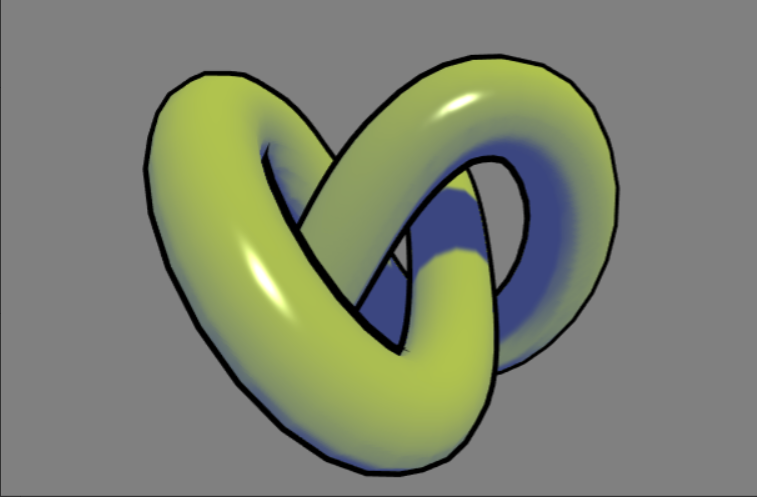
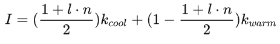
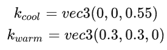
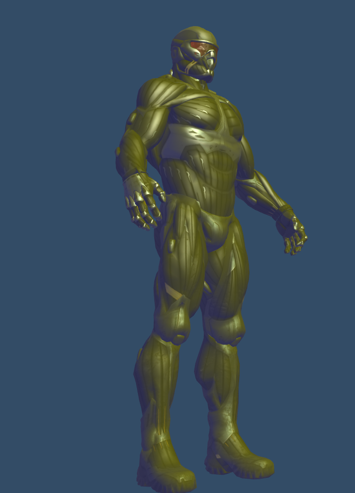
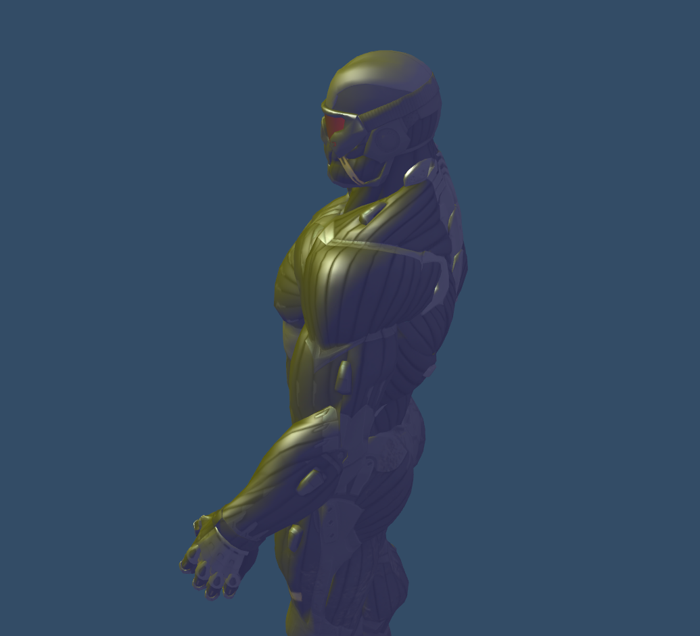

# 项目简介 &nbsp; A Non-Photorealistic Lighting Model For Automatic Technical Illustration
&nbsp;&nbsp;&nbsp;&nbsp;&nbsp;&nbsp;&nbsp;&nbsp;这篇论文是一片经典的风格化渲染的论文，风格化渲染应用很多如卡通渲染、水墨渲染等，这些风格化渲染有一个比较明显的特点：并不需要严格遵循物理中的光学，风格化后的艺术效果才是评价质量的考虑因素。而本文则是一种冷暖色调的渲染，也可以称为Tone Based Shading，其将场景的亮度转换为冷暖效果，参考效果图如图1。

 

图1 Tone Based Shading 简单展示

 
&nbsp;&nbsp;&nbsp;&nbsp;&nbsp;&nbsp;&nbsp;&nbsp;本文是一种非常简单的风格化渲染，也只哟个了一个Pass来实现。

# 具体实现
## ShadingPass
&nbsp;&nbsp;&nbsp;&nbsp;&nbsp;&nbsp;&nbsp;&nbsp;实际上本文就是相当于在blinn Phong模型(Monica大佬使用的是Phong模型，我进行了方法改进，也得到了我个人认为更好的效果)的基础上进行了一个后处理，blinn Phong模型的原理在网上由很多介绍，这里就不过多介绍。

* 在Phong模型和Blinn Phong之中可以通过入射光线 _l_ 和着色点法线 _n_ 的夹角的 _cos_ 来描述物体的明暗关系，由于( _l · n_ )的范围是 -1.0 ~ 1.0，可以使用 ( _l · n_ + 1)/2的方式对其进行正值化。而文章之中便使用了这个数值进行冷色和暖色之间的插值：

 

图2 冷暖色插值公式

&nbsp;&nbsp;&nbsp;&nbsp;&nbsp;&nbsp;&nbsp;&nbsp;通过调整 _kcool_ 和 _kwarm_ 的数值，便可以进行不同的风格化。而文章之中使用的值为：

 

图3 论文用值

# 效果展示
&nbsp;&nbsp;&nbsp;&nbsp;&nbsp;&nbsp;&nbsp;&nbsp;本文使用了Learning Opengl CN中常用的Nanosuit模型进行测试结果如图4和图5所示：
  

 

图4 Nanosuit效果展示1

 

图5 Nanosuit效果展示2

# 总结与评价
&nbsp;&nbsp;&nbsp;&nbsp;&nbsp;&nbsp;&nbsp;&nbsp; 这是一个非常简单无脑的风格化渲染的算法，然而，实际上，绝大多数风格化渲染的想法都是同源的，大多需要在一次正常渲染之后进行后处理加上对应的风格，清楚其基本思路之后，可以参考各种风格化的参数或其他思路去实现各种风格化。
 
 
# 参考资料：

[1] Gooch, Amy & Gooch, Bruce & Shirley, Peter & Cohen, Elaine. (1999). A Non-Photorealistic Lighting Model For Automatic Technical Illustration. Proceedings of the ACM SIGGRAPH Conference on Computer Graphics. 10.1145/280814.280950.    
[2] 知乎：Monica的小甜甜：【论文复现】A Non-Photorealistic Lighting Model For Automatic Technical Illustration 
