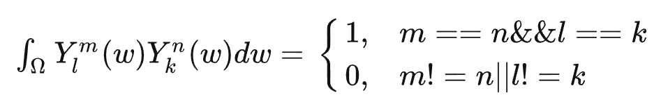
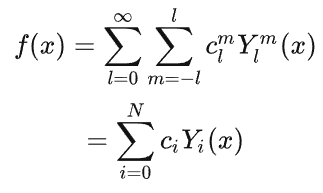
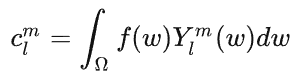
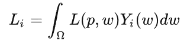
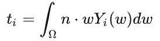
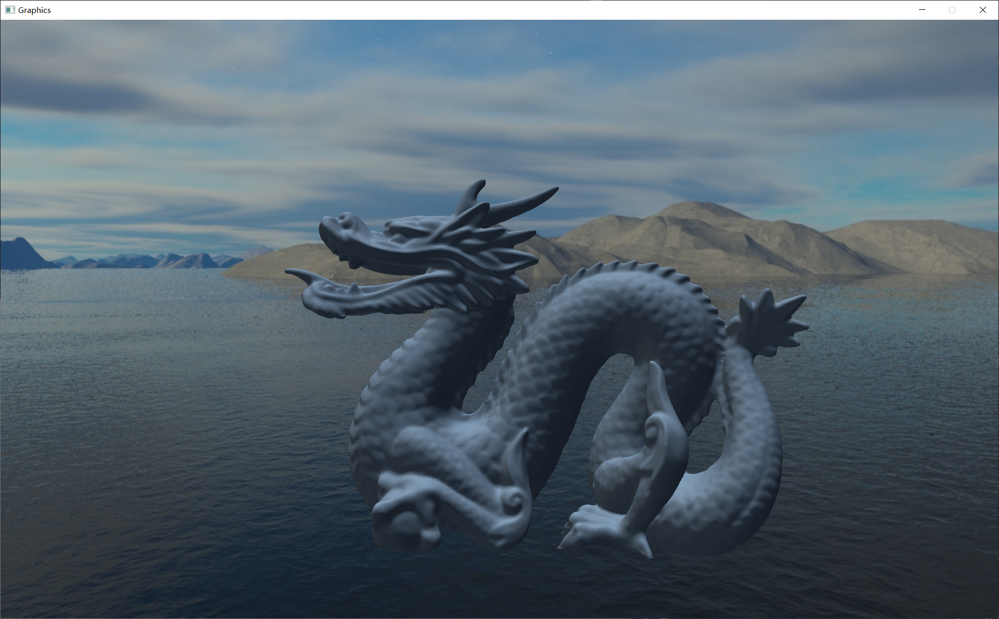
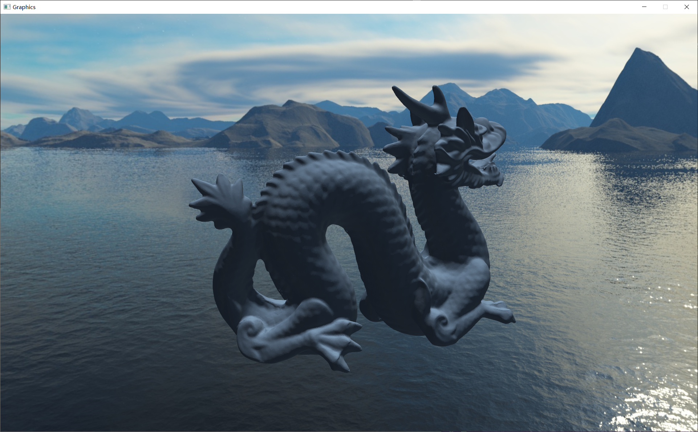

# 项目简介 &nbsp; 球谐光照 Spherical Harmonic Lighting The Gritty Details
&nbsp;&nbsp;&nbsp;&nbsp;&nbsp;&nbsp;&nbsp;&nbsp;这是一篇03年的对于球谐光照的介绍文章，虽然是03年的文章，但是涉及到一个比较抽象且非常实用的函数，叫做球谐函数，而利用球谐函数来计算天空盒的环境光照可以通过预计算的方式来避免对天空盒贴图的高频采样。

# 漫反射环境光
&nbsp;&nbsp;&nbsp;&nbsp;&nbsp;&nbsp;&nbsp;&nbsp;球谐光照的最主要的作用便是计算环境光，而对于来自天空盒、天空球的采环境光照存在一个特点：天空盒、球无限大，我们的模型不管多大，对于计算模型上的任意一个着色点，我们都不需要考虑其位置信息，因为天空盒无限大，任何一个点都可以视作是天空盒的中心点，也因此，我们只需要考虑法线信息即可。

$$
L\left(p, w_{o}\right)=\int_{\Omega} L\left(p, \omega_{i}\right) n \cdot \omega_{i} d w_{i}
$$

&nbsp;&nbsp;&nbsp;&nbsp;&nbsp;&nbsp;&nbsp;&nbsp; ${\Omega}$为半球空间，入射方向 $w_{i}$ ，观察方向 $w_{o}$ ，着色点 $p ， n$ 为着色点 $p$ 的法线，这个公式就描述了着色点 $p$ 在整个球面空间中收到的光照总和，由于上述环境光的特点 ， $p$位于天空盒的中心，光照方程就变成了:

$$
L\left(p, w_{o}\right)=L(n)=\int_{\Omega} L\left(\omega_{i}\right) n \cdot \omega_{i} d w_{i}
$$

&nbsp;&nbsp;&nbsp;&nbsp;&nbsp;&nbsp;&nbsp;&nbsp;另一种常用的天空盒的环境光照计算方式IBL便是基于上述思路，预计算每个法线 $n$ 对应的 $L(n)$ ，将其保存后，计算任何一个着色点只需要根据具体的法线去取出对应的结果 $L(n)$ 即可,具体可以参考  [IBL](https://learnopengl-cn.github.io/07%20PBR/03%20IBL/01%20Diffuse%20irradiance/)。

# 球谐函数性质
&nbsp;&nbsp;&nbsp;&nbsp;&nbsp;&nbsp;&nbsp;&nbsp;球谐函数看似是一个很复杂的一个概念，但是其实不用太过在意其原理以及各种基函数怎么构建的，以我个人的理解，可以将其视为复杂一些的傅里叶变化，区别便是傅里叶变化以三角函数作为基函数，而球谐函数则是以球谐基函数组合来实现对球面函数的拟合。而球谐函数则是具备两个重要的特性：

* __正交完备性__ :两个球谐函数相乘在球面进行积分的时候，两个球谐函数一摸一样时，积分结果为1，否则结果为0，也就是任何两个不同的球谐基函数之间是正交归一的。以某一正交归一函数组为基，把一个给定的函数用这些函数的线性组合来表示，这就是一种重要的展开，这种用正交函数组展开为级数的一个显著的例子就是傅里叶变换，而球谐函数也能参考傅里叶变换进行理解。这个式子可以表达为：

 

* __旋转不变性__ ：表示原函数发生了旋转，只需要对生成的广义傅里叶系数进行变换，就能保证变换后的系数能等价还原出新函数。在图形渲染上的表现就是，当光源发生旋转后，我们只要同步的计算出变换后的广义傅里叶系数，就能保证画面的光照效果不会抖动跳变。旋转不变性，并不是表示源函数发生旋转后，对重建结果没有影响，而是表示通过对系数与匹配的旋转进行变换后，能等价的还原出旋转后的函数。 __这个性质使得球谐函数能够适用于多种场景__ 。

# 球谐函数展开计算球谐光照
&nbsp;&nbsp;&nbsp;&nbsp;&nbsp;&nbsp;&nbsp;&nbsp;对于复杂的函数，我们可以通过如泰勒展开、广义傅里叶展开等方式讲复杂的函数进行简化，而本文适用的便是球谐函数展开：

 

&nbsp;&nbsp;&nbsp;&nbsp;&nbsp;&nbsp;&nbsp;&nbsp;其中 $i = l*(l+1)+m,  N = l^{2}，c_l^m$ 为常数，也叫做 __球谐系数__ ,而如何计算得到每一个球谐基函数对应的球谐系数呢？如果您学过傅里叶展开，那么这个计算方法可以参考理解，而这个过程也同样被称为投影（实质上是一样的，都是将函数向正交基进行投影），只需要计算原函数 $f(w)$ 和任何一个基函数$Y_l^m(w)$相乘在球面上的积分即可。

 

&nbsp;&nbsp;&nbsp;&nbsp;&nbsp;&nbsp;&nbsp;&nbsp;接下来将使用用球谐函数来进行球谐光照的推导：

$$
\left\{\begin{array}{l}
\operatorname{light}(w)=L(p, w) \\
t(w)=n \cdot w
\end{array}\right.
$$

&nbsp;&nbsp;&nbsp;&nbsp;&nbsp;&nbsp;&nbsp;&nbsp;实际上我们将光照的积分项拆分为了与光照相关的$L(p, w)$ 和与入射方向和法线的夹角为 $n · w$,之后按照球谐展开的方式分别对两个球面函数进行展开即可得到下式 (其中$L_i和t_i$是计算出的第$i$组球谐系数) ：

$$
\left\{\begin{array}{l}
\operatorname{light}(w)=\sum_{i=0} L_{i} Y_{i}(w) \\
t(w)=\sum_{i=0} t_{i} Y_{i}(w)
\end{array}\right.
$$

&nbsp;&nbsp;&nbsp;&nbsp;&nbsp;&nbsp;&nbsp;&nbsp;实际上，如果想要无限逼近准确结果，我们使用球谐函数进行预计算的阶数越高越好，而实际操作中想要近似表现漫反射环境光，只需要$L = 3$即可，那么$N = 9$，将两个球面函数的球谐展开代入原漫反射环境光照的表达式中有：

$$
\begin{aligned}
& L\left(p, w_{o}\right)=\int_{\Omega} \operatorname{ligh} t(w) \cdot t(w) d w \\
=& \int_{\Omega}\left(\sum_{j=0} \sum_{i=0}\left(L_{i} Y_{i}(w)\right) \cdot\left(t_{j} Y_{j}(w)\right)\right) d w \\
=& \int_{\Omega}\left(\sum_{i=0} L_{i} Y_{i}(w)\right) \cdot\left(\sum_{j=0} t_{j} Y_{j}(w)\right) d w
\end{aligned}
$$

&nbsp;&nbsp;&nbsp;&nbsp;&nbsp;&nbsp;&nbsp;&nbsp;而很容易可以理解，我们可以将与$w$无关的参数和累加函数都提取到积分函数外边，如此便可以得到下式：
$$
=\sum_{j=0} \sum_{i=0} L_{i} t_{j} \int_{\Omega} Y_{i}(w) Y_{j}(w) d w
$$
&nbsp;&nbsp;&nbsp;&nbsp;&nbsp;&nbsp;&nbsp;&nbsp;这个时候只看积分里面就用得上我们的性质一：正交完备性。有且仅有 $i = j$ 的时候 $\int_{\Omega} Y_{i}(w) Y_{j}(w) d w$ 才为 1 ，其余都为 0 。代入上式中便得到了非常厉害的化简:

$$
L\left(p, w_{o}\right)=\sum_{i=0} L_{i} t_{i}
$$

&nbsp;&nbsp;&nbsp;&nbsp;&nbsp;&nbsp;&nbsp;&nbsp;看样子，到这里问题似乎很明朗了，对于任何一个点的漫反射光照，我们只需要读取出$2*N$个预计算得到的参数两两相乘相乘并累加即可，然而这里存在一个问题：如何预计算并存储这些参数呢?

* $L_i$:

 

&nbsp;&nbsp;&nbsp;&nbsp;&nbsp;&nbsp;&nbsp;&nbsp;这里虽然有着色点位置$p$，但是前文已经说过，在天空盒下，可以忽略位置信息，因此直接可以对天空和进行积分，如此很简单就可以计算得到天空盒展开后的球谐系数。

* $t_i$:

 

&nbsp;&nbsp;&nbsp;&nbsp;&nbsp;&nbsp;&nbsp;&nbsp;不同于$L_i$的计算，$t_i$的与着色点的法线有关，因此我们获取一个着色点的$t_i$参数的时候需要通过对textureCube以法线$n$进行采样，这也就使得如果使用3阶球谐函数，展开，可以使用3张三通道的textureCube，每一张分别存储三个$t$。(实际上如此需要的存储空间非常大，比起IBL空间复杂度大得多，这个将在后续项目10中进行改进)

# 具体实现
## SkyboxPass
&nbsp;&nbsp;&nbsp;&nbsp;&nbsp;&nbsp;&nbsp;&nbsp;SkyboxPass其实就是将天空盒渲染出来的一个过程很简单不再详解。

## ShadingPass
&nbsp;&nbsp;&nbsp;&nbsp;&nbsp;&nbsp;&nbsp;&nbsp;本文使用的是已经预计算好的球谐函数直接进行采样，代码中不涉及预计算的过程，因此实际上很简单，理解上文公式即可很简单地得到预期的效果。

# 效果展示
&nbsp;&nbsp;&nbsp;&nbsp;&nbsp;&nbsp;&nbsp;&nbsp;最初使用了经典的Dragon作为测试，得到效果如图1和图2所示：
  

 

图1 Dragon效果展示1

 

图2 Dragon效果展示2

# 总结与评价
&nbsp;&nbsp;&nbsp;&nbsp;&nbsp;&nbsp;&nbsp;&nbsp; SH是一个很厉害的概念，能够很巧妙地通过预计算实现对球面函数的拟合，在闫老师的games系列中第一次接触到了这个概念，那时候只是学会了学步似的去用，这次实现让我对SH的理解进了一步。而本文的算法主要使用了球谐函数的第一个性质，第二个很巧妙的旋转不变性也是非常实用的，在项目11的实现之中可以利用这一性质不再需要预计算那么多张$t_i$的方法，那样球谐光照将会得到非常大的改善。
 
 
# 参考资料：

[1] Green, Robert. “Spherical Harmonic Lighting: The Gritty Details.” (2003).   
[2] 知乎：Monica的小甜甜：【论文复现】Spherical Harmonic Lighting:The Gritty Details 
[3] 知乎：浦夜：球谐函数介绍（Spherical Harmonics）
