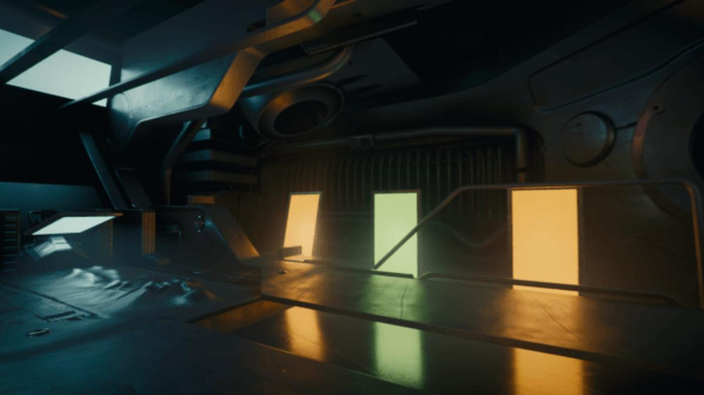
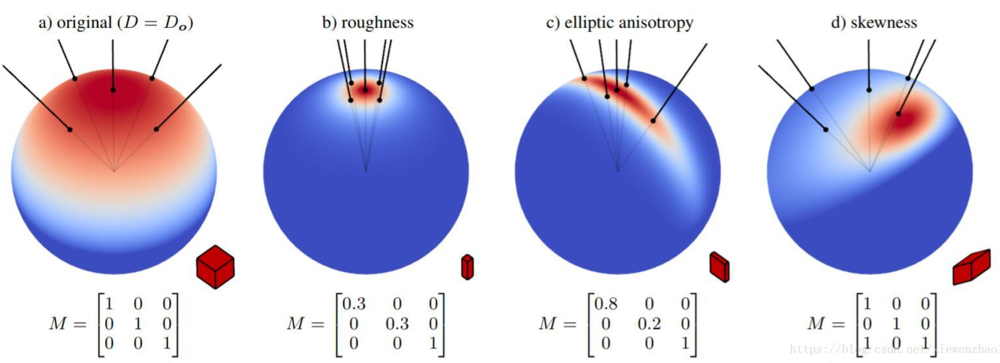
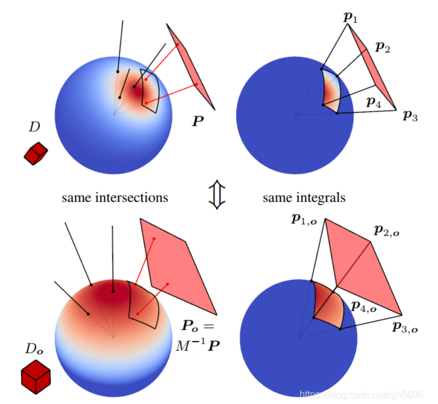
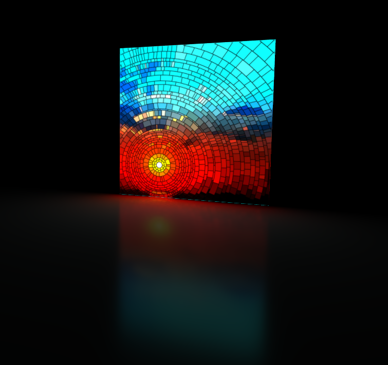
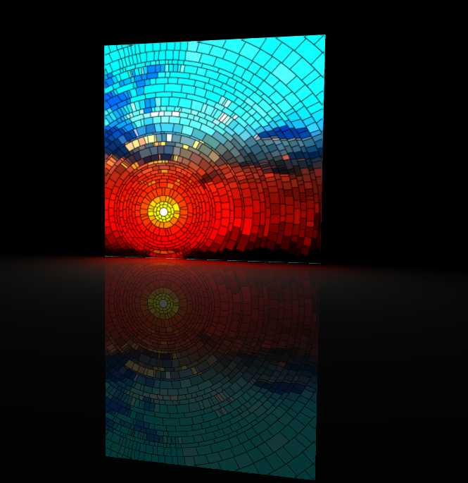

# 项目简介 &nbsp; 面光源 RealTime Polygonal Light Shading With Linearly Transformed Cosine
&nbsp;&nbsp;&nbsp;&nbsp;&nbsp;&nbsp;&nbsp;&nbsp;在09的球谐光照之中，我们体会到了数学在图形学之中能够发挥多大的作用，而这篇文章则是在面光源的计算领域实现了明显突破，而她也是引入了一种非常巧妙的数学方法 Linearly Transformed Cosine，本文可能会有些抽象，不理解的话可以查查LTC资料加深理解。

 

图1 面光源的理想效果

&nbsp;&nbsp;&nbsp;&nbsp;&nbsp;&nbsp;&nbsp;&nbsp;图形学渲染之中，我们对于点光源和方向光都已经很熟悉了，然后还有一种光源常用于渲染之中：面光源，然而面光源的计算是非常困难的，1989年 Daniel[1] 采用形状因子的方法解决了无AO的漫反射面光源，可光泽反射的面光源一直都采用各种trick骗过人眼的。而本文使用线性变换球面分布的数学思想解决了光泽反射的面光源的问题。

 

# 面光源简介
&nbsp;&nbsp;&nbsp;&nbsp;&nbsp;&nbsp;&nbsp;&nbsp;在多边形光源 Polygonal-Light 渲染中，所需要解决的问题就是求辐照度 irradiance 积分
$$
L\left(p, w_{o}\right)=\int_{S} \frac{L\left(s,-\ {i}\right)}{\pi\|s-p\|^{2}}  \rho\left(p, w_{i}, w_{o}\right) \cos \left(\theta_{p}\right) d w_{i}
$$
&nbsp;&nbsp;&nbsp;&nbsp;&nbsp;&nbsp;&nbsp;&nbsp;上式中，$S$ 为面光源区域， $s$ 为面光源上的某一个点， $p$ 为着色点， $n_{p}$ 为着色点法线， $w_{i}$ 为 $s$ 到 $p$ 的向量， $\theta_{p}$ 为 $n_{p}$ 与 $w_{i}$ 的夹角。从这个积分式是十分复杂的，但实际上可以将其拆解开来进行理解，其中 $L\left(s,-\omega_{i}\right)$ 是面光源上的而纹理颜色，其下方的分母则是光源的球面衰减，而 $\rho\left(p, w_{i}, w_{o}\right)$ 则是球面BRDF，如此便能够帮助理解。 不过在此之前我们先给出Daniel解决的无AO的漫反射面光源公式即：
$$
L\left(p, w_{o}\right)=\int_{S} \frac{1}{\pi\|s-p\|^{2}} \cos \left(\theta_{s}\right) \cos \left(\theta_{p}\right) d w_{i}
$$
&nbsp;&nbsp;&nbsp;&nbsp;&nbsp;&nbsp;&nbsp;&nbsp;$\theta_{s}$ 为 面光源上s点的法线 $n_{s}$ 与 $-w_{i}$ 的夹角。可以看出来两个式子极其的相似，只是光泽反射多了 复杂的BRDF以及面光源上纹理的颜色。

 

# 线性变换球面分布 LTSD(Linearly Transformed Spherical Distributions)
&nbsp;&nbsp;&nbsp;&nbsp;&nbsp;&nbsp;&nbsp;&nbsp;论文作者就使用了一种线性变换球面分布LTSDs的思想。这种思想就是对于任意一个球面分布函数，一定可以通过一个线性变换矩阵将 其变化到另外一个球面分布函数。由于 $\cos \left(\theta_{s}\right)$ 是一个球面分布函数（余弦分布函数 ) ，$ \rho\left(p, w_{i}, w_{o}\right)$ 也是一个球面分布函数，如果可以用这个思想的话，那么复杂的BRDF就能够通过一个线性变换矩阵$M$由余弦分布变换而来：
$$
\rho\left(p, w_{i}, w_{o}\right) \approx M * \cos \left(\theta_{s}\right)
$$
&nbsp;&nbsp;&nbsp;&nbsp;&nbsp;&nbsp;&nbsp;&nbsp;这个式子中的 * 不是矩阵乘法，而是入射方向的线性变换(注意使用单位向量，在线性变换之后进行了标准化，标准化的过程会导致非线性，但直观而言还是使用“线性”标识)：
$$
\omega =\frac{M\omega_{o}} {||M\omega_{o}||}\\
\omega_{o} =\frac{M^{-1}\omega} {||M^{-1}\omega||} 
$$
&nbsp;&nbsp;&nbsp;&nbsp;&nbsp;&nbsp;&nbsp;&nbsp;而将一个球面分布函数$D_o$通过线性变换得到下式：
$$
D(\omega)=D_{o}\left(\omega_{o}\right) \frac{\partial \omega_{o}}{\partial \omega}=D_{o}\left(\frac{M^{-1} \omega}{\left\|M^{-1} \omega\right\|}\right) \frac{\left|M^{-1}\right|}{\left\|M^{-1} \omega\right\|^{3}}
$$
&nbsp;&nbsp;&nbsp;&nbsp;&nbsp;&nbsp;&nbsp;&nbsp;其中 $\frac{\partial \omega_{o}}{\partial \omega}=\frac{\left|M^{-1}\right|}{\left\|M^{-1} \omega\right\|^{3}}$ 是变换 $\mathrm{M}$ 的 Jacobian ${ }^{[3]}$ (Jacobian的推导看论文的附录A，就是微分上的几何推导）。

&nbsp;&nbsp;&nbsp;&nbsp;&nbsp;&nbsp;&nbsp;&nbsp;当 $M$ 是缩放和旋转时， $M$ 不改变分布的形状，此时 $\frac{\partial \omega_{o}}{\partial \omega}=1$

&nbsp;&nbsp;&nbsp;&nbsp;&nbsp;&nbsp;&nbsp;&nbsp;证明

&nbsp;&nbsp;&nbsp;&nbsp;&nbsp;&nbsp;&nbsp;&nbsp;当 $M$ 是缩放时，有

$$
M=\lambda I \\
\left|M^{-1}\right|=\frac{1}{\lambda^{3}}\\
\left\|M^{-1} \omega\right\|=\frac{1}{\lambda}\\
\frac{\partial \omega_{o}}{\partial \omega}=\frac{\left|M^{-1}\right|}{\left\|M^{-1} \omega\right\|^{3}}=1
$$

&nbsp;&nbsp;&nbsp;&nbsp;&nbsp;&nbsp;&nbsp;&nbsp;当 $M$ 是旋转时，有
$$
M=R\\
\left|M^{-1}\right|=1\\
\left\|M^{-1} \omega\right\|=1\\
\frac{\partial \omega_{o}}{\partial \omega}=\frac{\left|M^{-1}\right|}{\left\|M^{-1} \omega\right\|^{3}}=1
$$

&nbsp;&nbsp;&nbsp;&nbsp;&nbsp;&nbsp;&nbsp;&nbsp;图2展示了一部分线性变换矩阵$M$对应的球面分布情况

 

图2 线性变换的球面分布

## LTSD在积分中的性质

 - 球面积分: $\int_{\Omega} D(\omega) \mathrm{d} \omega=\int_{\Omega} D_{o}\left(\omega_{o}\right) \frac{\partial \omega_{o}}{\partial \omega} \mathrm{d} \omega=\int_{\Omega} D_{o}\left(\omega_{o}\right) \mathrm{d} \omega_{o}$
- 多边形积分： $\int_{P} D(\omega) \mathrm{d} \omega=\int_{P_{o}} D_{o}\left(\omega_{o}\right) \mathrm{d} \omega_{o}$ ，其中 $P_{o}=M^{-1} P$ (就是将每个多边形的顶点作线性变换，类似于球面积分，但是球面积分的积分范围进行线性变换仍然是球面)

 

图3 线性变换后的积分表示

&nbsp;&nbsp;&nbsp;&nbsp;&nbsp;&nbsp;&nbsp;&nbsp;到这里，我们已经能够大致清楚我们需要做的是什么：利用LTSD在多边形范围内的积分数值不变这一性质，将原本平面光范围的积分转换为另一个方便计算的积分范围即可，这便是下一步：使用LTC近似BRDF。

# 面光源计算
## 以LTC近似BRDF
&nbsp;&nbsp;&nbsp;&nbsp;&nbsp;&nbsp;&nbsp;&nbsp;结合面光源简介中的公式，我们需要做的一步就是将BRDF线性变换成便于积分的余弦分布，那么我们需要的LTC的 $D_o$为：

&nbsp;&nbsp;&nbsp;&nbsp;&nbsp;&nbsp;&nbsp;&nbsp;$D_{o}\left(\omega_{o}=(x, y, z)\right)=\frac{1}{\pi} \max (0, z)$

&nbsp;&nbsp;&nbsp;&nbsp;&nbsp;&nbsp;&nbsp;&nbsp;将 $D_{o}$ 代入 $D(\omega)=D_{o}\left(\frac{M^{-1} \omega}{\left\|M^{-1} \omega\right\|}\right) \frac{\left|M^{-1}\right|}{\left\|M^{-1} \omega\right\|^{3}}$ 即可得线性变换余弦 linearly transformed cosines (LTC)。

&nbsp;&nbsp;&nbsp;&nbsp;&nbsp;&nbsp;&nbsp;&nbsp;使用了 GGX BRDF (菲涅尔项为 1,此处不考虑具体的菲涅尔项，如此所需要预计算存储的只需要与$\theta$ 和粗糙度 $\alpha$ 相关的二维纹理)，近似的 $D$ 为
$D \approx \rho\left(p, w_{i}, w_{o}\right)$， 
对于各项同性的 BRDF，BRDF 只取决于入射方向 $\omega_{i}$ 与法线 $n$ 之间的夹角 $\theta_{i}$ 和粗糙度 $\alpha$ 。对于任意 $\left(\theta_{i}, \alpha\right)$ 我们可以找到一个 LTC 来近似，也就是找到一个 $M$ （这是非线性优化问题，可用各种工具求解，具体操作可以参考代码库中的FitLTCMatrix项目，对于一组 $\left(\theta_{i}, \alpha\right)$ 使用单纯形法不断修正矩阵M直到误差在可接受的范围内)。由于各向同性 BRDF 有平面对称性且 LTSD 有缩放不变性， $M$ 可表示为
$$
M=\left[\begin{array}{lll}
a & 0 & b \\
0 & c & 0 \\
d & 0 & 1
\end{array}\right]
$$
&nbsp;&nbsp;&nbsp;&nbsp;&nbsp;&nbsp;&nbsp;&nbsp;在实践中发现，这样子 $a b c d$ 随 $(\theta, \alpha)$ 的变化不平缓。 在最终的实现中使用的矩阵是
$$
M=\left[\begin{array}{lll}
a & 0 & b \\
0 & 1 & 0 \\
c & 0 & d
\end{array}\right]
$$
&nbsp;&nbsp;&nbsp;&nbsp;&nbsp;&nbsp;&nbsp;&nbsp;这样拟合只用考虑4个变量，拟合的矩阵的 __逆矩阵(注意存储的是逆矩阵)__（同样只有四个参数，在渲染过程中只需要逆矩阵) 可以存储在一个 $2D$ 四通道的 LUT 中。

 

## 菲涅尔项计算
&nbsp;&nbsp;&nbsp;&nbsp;&nbsp;&nbsp;&nbsp;&nbsp;由于上述拟合BRDF的过程中，我们完全忽略了BRDF中的菲涅尔项(完全设置为1)，菲涅耳项包含了一个与材质固有属性相关的F0项，即0度角入射的菲涅尔反射率。而参考[LTC Fresnel Approximation](extension://bfdogplmndidlpjfhoijckpakkdjkkil/pdf/viewer.html?file=https%3A%2F%2Fadvances.realtimerendering.com%2Fs2016%2Fs2016_ltc_fresnel.pdf)，可以在上述基础之上添加菲涅尔项：

$$
\begin{aligned}
\mathrm{n} &=\int_{\Omega} \mathrm{F}\left(\omega_{\mathrm{v}}, \omega_{1}\right) \rho\left(\omega_{\mathrm{v}}, \omega_{1}\right) \cos \theta_{1} \mathrm{~d} \omega_{1} \\
&=\int_{\Omega}\left[\mathrm{F}_{0}+\left(1-\mathrm{F}_{0}\right)\left(1-\left\langle\omega_{1}, \omega_{\mathrm{h}}\right\rangle^{5}\right)\right] \rho\left(\omega_{\mathrm{v}}, \omega_{1}\right) \cos \theta_{\mathrm{l}} \mathrm{d} \omega_{1} \\
&=\mathrm{F}_{0} \int_{\Omega} \rho\left(\omega_{\mathrm{v}}, \omega_{1}\right) \cos \theta_{1} \mathrm{~d} \omega_{1}\left(1-\mathrm{F}_{0}\right) \int_{\Omega}\left(1-\left\langle\omega_{1}, \omega_{\mathrm{h}}\right\rangle^{5}\right) \rho\left(\omega_{\mathrm{v}}, \omega_{1}\right) \cos \theta_{1} \mathrm{~d} \omega_{1} \\
&=\mathrm{F}_{0} \mathrm{n}_{\mathrm{D}}+\left(1-\mathrm{F}_{0}\right) \mathrm{f}_{\mathrm{D}}
\end{aligned}
$$
将 $\mathrm{n}_{\mathrm{D}}$ 和 $\mathrm{f}_{\mathrm{D}}$ 进行预计算存储，这和PBR中的BRDF-LUT没有什么不同。

# 具体实现
## LTC预计算
&nbsp;&nbsp;&nbsp;&nbsp;&nbsp;&nbsp;&nbsp;&nbsp;使用根目录中的FitLTCMatrix项目可以进一步学习如何对BRDF的LTC预计算和菲涅尔项参数的预计算。

## DrawTextureArray
&nbsp;&nbsp;&nbsp;&nbsp;&nbsp;&nbsp;&nbsp;&nbsp;这一段是本篇论文中的另一个比较有趣的点，去观察代码可以发现，这个Pass并没有渲染什么，主要是加载了8幅图如图5，实质上是将面光源的Texture进行层层高斯滤波，去模拟距离光线越远，其光线锐度越弱，其原因也是距离较远的地方可以接受到面光源较大范围内的光线，而高斯模糊便是模拟了这一过程，（具体操作中根据着色点距离光源的距离判断使用哪一个层级的纹理颜色即可）。

## GroundPass
&nbsp;&nbsp;&nbsp;&nbsp;&nbsp;&nbsp;&nbsp;&nbsp;前边我们已经了解了如何通过一个线性变换矩阵$M$将复杂的BRDF的积分转换成为另一个积分范围(同样由$M$矩阵线性变换而来)的余弦函数的积分，进而可以得到一个非常近似的解析解。

&nbsp;&nbsp;&nbsp;&nbsp;&nbsp;&nbsp;&nbsp;&nbsp;具体操作之中，将光源分为了两个部分，分别是Diffuse和Specular，Diffuse项直接可以不使用LTC进行变换，使用原始光源形状进行积分就可以得到近似的光照强度，而Specular则是使用矩阵$M$进行线性变换，同时加上菲涅尔项的影响，Specular的存在将会大幅加强带纹理的多边形平面光源的场景影响细节。

&nbsp;&nbsp;&nbsp;&nbsp;&nbsp;&nbsp;&nbsp;&nbsp;而由线性变化球面分布中我们使用了 $D_{o}\left(\omega_{o}=(x, y, z)\right)=\frac{1}{\pi} \max (0, z)$ 进行线性变换后的积分，正如下式：
$$
\begin{aligned}
& E\left(P_{o}\right) = \int_{P_{o}} D_{o}\left(\omega_{o}\right) \mathrm{d} \omega_{o} \\
\end{aligned}
$$
其中 $E\left(P_{o}\right)$ 有解析解 (18 世纪 Lambert 给出) ，将多边形积分转化为线积分，如下
$$
\mathrm{E}\left(p_{1}, \ldots, p_{n}\right)=\frac{1}{2 \pi} \sum_{i=1}^{n} \operatorname{acos}\left(\left\langle p_{i}, p_{j}\right\rangle\right)\left\langle\frac{p_{i} \times p_{j}}{\left\|p_{i} \times p_{j}\right\|},\left[\begin{array}{l}
0 \\
0 \\
1
\end{array}\right]\right\rangle
$$
&nbsp;&nbsp;&nbsp;&nbsp;&nbsp;&nbsp;&nbsp;&nbsp;其中 $j = (i+1)\quad mod \quad {n}$ , 而即使是线性变换后的，我们所需要的积分范围也只需要上半球，因此在多边形的各个顶点在进行线性变换之后，需要进行一个上半球判断，如果存在不在上半球的顶点，需要进行多边形的裁剪，而本代码中的设计之中最多只支持四边形被裁减成为5边形，这部分可能代码长度较长，但是不要被吓到，实质上比较好理解。

 

# 效果展示
&nbsp;&nbsp;&nbsp;&nbsp;&nbsp;&nbsp;&nbsp;&nbsp;本文使用的是和Monica大佬一致的效果展示，在我自己理解算法的过程中，发现他在实现的时候有一些内容与LTC论文中算法不太一致的地方，参考了论文和其他资料进行了一些修改，尽管不能说一定效果上更好，但是与参考资料的一致性会好一些，便于大家理解。本文得到的具体效果如图4、图5所示：
  

 

图4 roughness = 0.2 效果

 

图5 roughness = 0.0 效果

# 总结与评价
&nbsp;&nbsp;&nbsp;&nbsp;&nbsp;&nbsp;&nbsp;&nbsp; 本文是继SH后的第二个比较抽象的算法，但是效果也是好的让人拍手称赞，这充分说明了数学的强大，而本文的线性变换球面分布的思想非常厉害，而且在学习本文的时候，我也思考了，并不是说LTC只能应用于平面光源，而是真正的，球面分布函数就可以通过这种方法进行预计算，比如Monica大佬提到的光泽反射的BRDF等，数学nb！。
 
 
# 参考资料：

[1] Heitz, Eric & Dupuy, Jonathan & Hill, Stephen & Neubelt, David. (2016). Real-time polygonal-light shading with linearly transformed cosines. ACM Transactions on Graphics. 35. 1-8. 10.1145/2897824.2925895 .   
[2] 知乎：Monica的小甜甜：【论文复现】Real-Time Polygonal-Light Shading with Linearly Transformed Cosines 
[3] CSDN：桑来93：图形学基础|基于LTC的面光源渲染  
[4] 知乎：Ubp.a: Real-Time Polygonal-Light with LTC
