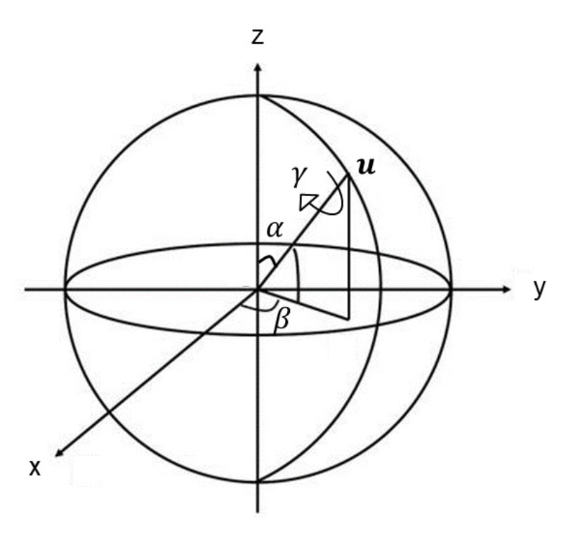
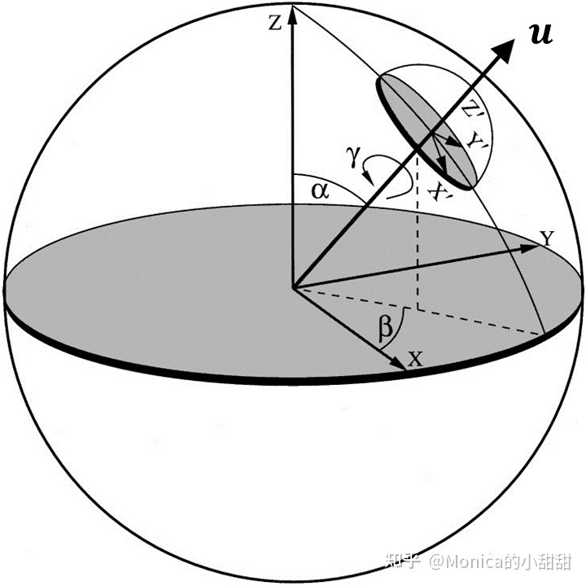
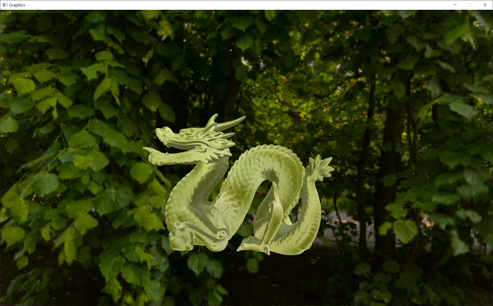
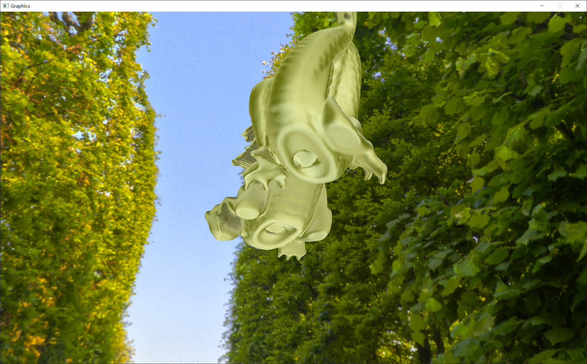
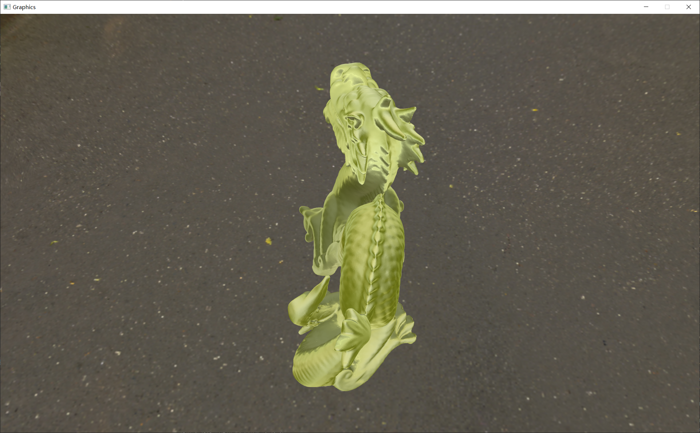
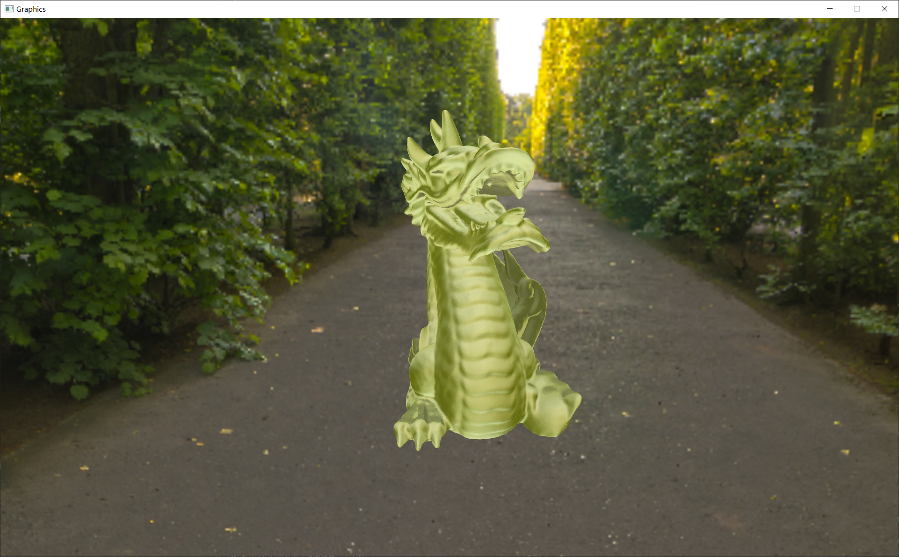

# 项目简介 &nbsp; 改进的球谐光照 An Efficient Representation for Irradiance Environment Maps
&nbsp;&nbsp;&nbsp;&nbsp;&nbsp;&nbsp;&nbsp;&nbsp;本文是接着09项目[Spherical Harmonic Lighting:The Gritty Details]()的一篇文章，正如09项目的README中所述，原先的球谐光照使用球谐函数分别使用球谐函数预计算了天空盒光照和光照与着色点法线夹角 $n · \omega_i$ ,但是如果您还记得，这一方法有一个非常明显的缺点： __针对每个方向的法线都需要预计算一组球谐系数__ ，这就导致我们需要非常大的存储空间来存储多张TextureCube，这是完全不能接受的。而本文则利用了球谐函数的第二个性质 __旋转不变性__ 来有效解决这一问题。

 

# 球谐函数旋转变换

&nbsp;&nbsp;&nbsp;&nbsp;&nbsp;&nbsp;&nbsp;&nbsp;球谐函数的旋转不变性并不是说无论如何旋转，预计算出的各阶球谐系数都不会发生变化，而是在对球面参数进行了一个旋转之后，我们能够通过一系列转换，由原本的各阶球谐系数分别乘以一个有旋转矩阵计算得到的变换矩阵，便可以得到旋转过后的各阶球谐系数，这样的一个计算速度远远快于重新计算一组球鞋系数，这便是球谐函数在旋转上非常方便的一个性质，下边将展示旋转的过程：

$$
Y_{l}^{m}(\mathbf{\pmb{u}})\tag{1}
$$
&nbsp;&nbsp;&nbsp;&nbsp;&nbsp;&nbsp;&nbsp;&nbsp;对于上述球谐函数 ($\mathbf{\pmb{u}}$ 为球面上的点的坐标，如果将 $\mathbf{\pmb{u}}$ 进行旋转，假设进行 $\alpha, \beta, \gamma$ 三个方向的旋转如图1所示:

 

图1 球面旋转示意图

&nbsp;&nbsp;&nbsp;&nbsp;&nbsp;&nbsp;&nbsp;&nbsp;可以将图1中的旋转变换构建成为旋转矩阵：$R^{\alpha, \beta, \gamma}$ ，而 $R^{\alpha, \beta, \gamma}(\mathbf{\pmb{u}})$ 则表示了对 $\mathbf{\pmb{u}}$ 进行旋转变换的过程，则球谐函数经过化简之后为:

$$
\begin{gathered}
Y_{l}^{m}\left(R^{\alpha, \beta, \gamma}(\mathbf{\pmb{u}})\right)=\sum_{m^{\prime}=-l}^{l} D_{m^{\prime}, m}^{l}\left(R^{\alpha, \beta, \gamma}\right) Y_{l}^{m^{\prime}}(\mathbf{\pmb{u}}) \tag{2}  \\
D_{m^{\prime}, m}^{l}\left(R^{\alpha, \beta, \gamma}\right)=e^{-i m^{\prime} \alpha} d_{m^{\prime}, m}^{l}(\beta) e^{-i m \gamma}
\end{gathered}
$$

&nbsp;&nbsp;&nbsp;&nbsp;&nbsp;&nbsp;&nbsp;&nbsp;其中 $d_{m^{\prime}, m}^{l}$ 为维格纳 $\mathrm{D}$ 矩阵，具体表达式很复杂可以参考 [1]，球谐函数的具体化简过程大家可以 参考 [1][2] ，如此就，当 $\mathbf{\pmb{u}}$ 进行旋转的时候，各阶球谐系数不需要重新从头计算了，只需要把已经计算好的值再乘以一个矩阵就好了，这一下就大大简化了计算。接下来式2 其代入到普通函数中试试看。

对于函数 $f(\mathbf{u})$ ，将其采用球谐函数展开如下:
$$
f(\mathbf{u})=\sum_{l}^{\infty} \sum_{m=-l}^{l} c_{l}^{m} Y_{l}^{m}(\mathbf{u})\tag{3}
$$
同样，也将 $\mathbf{u}$ 进行旋转，代入式2得：
$$
\begin{aligned}
f\left(R^{\alpha, \beta, \gamma}(\mathbf{u})\right) &=\sum_{l}^{\infty} \sum_{m=-l}^{l} c_{l}^{m} Y_{l}^{m}\left(R^{\alpha, \beta, \gamma}(\mathbf{u})\right) \\
&=\sum_{l}^{\infty} \sum_{m^{\prime}=-l}^{l} g_{l}^{m^{\prime}} Y_{l}^{m^{\prime}}(\mathbf{u}) \\
g_{l}^{m^{\prime}} &=\sum_{m=-l}^{l} c_{l}^{m} D_{m^{\prime}, m}^{l}\left(R^{\alpha, \beta, \gamma}\right)\tag{4}
\end{aligned}
$$
&nbsp;&nbsp;&nbsp;&nbsp;&nbsp;&nbsp;&nbsp;&nbsp;经过层层变换，最终得到了式4，这就是球谐函数的旋转不变性，我们将旋转操作拆分为一个函数，从而通过两个函数的乘积就得到了旋转之后的函数值。而根据乘法结合律，本来是应该先计算 $D_{m^{\prime}, m}^{l}\left(R^{\alpha, \beta, \gamma}\right) Y_{l}^{m^{\prime}}(\mathbf{u})$ ，我们转化为先计算 $c_{l}^{m} D_{m^{\prime}, m}^{l}\left(R^{\alpha, \beta, \gamma}\right)$ ，如此一来就可以不用重新计算球谐系数，而是对原来的球谐系数进行处理就得到旋转之后的球谐系数。

 

# 球谐光照

 

## $L\left(\omega_{i}^{\prime}\right)$ 展开
&nbsp;&nbsp;&nbsp;&nbsp;&nbsp;&nbsp;&nbsp;&nbsp;首先，我们需要回顾以下环境光照的计算公式：
$$
L(n)=\int_{\Omega} L\left(\omega_{i}\right) n \cdot \omega_{i} d w_{i}\tag{5}
$$
&nbsp;&nbsp;&nbsp;&nbsp;&nbsp;&nbsp;&nbsp;&nbsp;$\Omega$ 为半球空间，入射光方向 $w_{i} ， n$ 为着色点 $p$ 的法线。这个公式就描述了着色点 $p$ 在整个半球面空间中收到的光照总和。
&nbsp;&nbsp;&nbsp;&nbsp;&nbsp;&nbsp;&nbsp;&nbsp;如果我们将观测目标着重于法线和入射光线的夹角，那么可以使用法线空间坐标系(以法线$n$为 $z$轴的局部坐标系)，而光线在世界坐标系中的光线来源方向如何计算呢？将法线坐标系中的光源方向进行旋转即可恢复世界坐标系中的光源方向，而这个旋转矩阵，就是法线坐标系到世界坐标系之间的旋转关系。式6展示了漫反射环境光照在法线坐标系中的表达式 __(注意本文中，在法线坐标系中的计算都携带有 ' 标记)。

 

图2 法线空间和世界坐标系之间的关系

$$
L(n)=\int_{\Omega} L\left(\omega_{i}^{\prime}\right) t\left(\theta^{\prime}\right) d w_{i}^{\prime}\tag{6}
$$

&nbsp;&nbsp;&nbsp;&nbsp;&nbsp;&nbsp;&nbsp;&nbsp;其中 $t\left(\theta^{\prime}\right)=n \cdot \omega_{i}^{\prime}=\cos \theta^{\prime}$ ，这里只有旋转没有平移操作：
$$
\left(w_{i}\right)=R^{\alpha, \beta, \gamma}\left(w_{i}^{\prime}\right)\tag{7}
$$

&nbsp;&nbsp;&nbsp;&nbsp;&nbsp;&nbsp;&nbsp;&nbsp;由于初步计算使用的是法线空间之中的积分计算，而 $\theta^{\prime}$ 的积分范围就是完整的半球，而需要进行修改的地方便是光源，而我们对于某个夹角 $\theta^{\prime}$， 我们先取出这个 $w_{i}^{\prime}$ 对应的球谐系数 $L_l^m$ 和 $Y_l^{m'}(w_{i}^{\prime})$, 后续便可以通过球谐函数的旋转不变性进行调整：

$$
L\left(\omega_{i}\right)=L\left(R^{\alpha, \beta, \gamma}\left(w_{i}^{\prime}\right)\right)=\sum_{l=0}^{\infty} \sum_{m=-l}^{l} L_{l}^{m} Y_{l}^{m}\left(R^{\alpha, \beta, \gamma}\left(w_{i}^{\prime}\right)\right)\\ \tag{8}
Y_{l}^{m}\left(R^{\alpha, \beta, \gamma}\left(w_{i}^{\prime}\right)\right)=\sum_{m^{\prime}=-l}^{l} D_{m^{\prime}, m}^{l}\left(R^{\alpha, \beta, \gamma}\right) Y_{l}^{m^{\prime}}\left(w_{i}^{\prime}\right)
$$

&nbsp;&nbsp;&nbsp;&nbsp;&nbsp;&nbsp;&nbsp;&nbsp;在得到公式8后，论文作者和Jackson3后续进行了化简(主要注意到如图2中，由于只需主要关注两个坐标系z轴之间的夹角 $ \alpha $ )，这一块比较难以理解，也可以不关注推导直接应用结论：
- 式8之中，$m^{\prime} !=0$ 的项都等于 0 ，也就是说只用考虑 $m^{\prime}=0$ 的情况即可。
- 当 $m^{\prime}=0$ 时，在只旋转 $\alpha$ 角的情况下，得到式9如下:
$$
D_{m^{\prime}, m}^{l}\left(R^{\alpha, \beta, \gamma}\right)=D_{0, m}^{l}(\alpha)=\sqrt{\frac{4 \pi}{2 l+1}} Y_{l}^{m}(n)\tag{9}
$$
&nbsp;&nbsp;&nbsp;&nbsp;&nbsp;&nbsp;&nbsp;&nbsp;带回到式8得到
$$
Y_{l}^{m}\left(R^{\alpha, \beta, \gamma}\left(w_{i}^{\prime}\right)\right)=\sqrt{\frac{4 \pi}{2 l+1}} Y_{l}^{m}(n) Y_{l}^{0}\left(w_{i}^{\prime}\right)\tag{10}
$$
&nbsp;&nbsp;&nbsp;&nbsp;&nbsp;&nbsp;&nbsp;&nbsp;最终结合式7就得到旋转 $\alpha$ 之后的 $L\left(\omega_{i}\right)$ :
$$
\begin{aligned}
L\left(\omega_{i}\right)=L\left(R^{\alpha, \beta, \gamma}\left(w_{i}^{\prime}\right)\right) &=\sum_{l=0}^{\infty} \sum_{m=-l}^{l} L_{l}^{m} \sqrt{\frac{4 \pi}{2 l+1}} Y_{l}^{m}(n) Y_{l}^{0}\left(w_{i}^{\prime}\right) \\\tag{11}
L_{l}^{m} &=\int_{\Omega} L(w) Y_{l}^{m}(w) d w
\end{aligned}
$$

## $t\left(\theta^{\prime}\right)$ 展开
&nbsp;&nbsp;&nbsp;&nbsp;&nbsp;&nbsp;&nbsp;&nbsp;实际上，项目09中，我们已经发现了，SH的简化计算要用到球谐函数的正交归一性，本文也不例外，既然已经实现了将旋转变换后的光源用球谐函数进行表达了，那么接下来就需要对 $t\left(\theta^{\prime}\right)$ 进行展开，最终利用这一性质进行化简(这个步骤同样在局部坐标系中进行)。由于 $t\left(\theta^{\prime}\right)$ 只是很简单的余弦函数，与其他参数也无关，因此将其展开为球谐函数也一样很好展开。

$$
t\left(\theta^{\prime}\right)=\cos \theta^{\prime}=\sum_{l=0}^{\infty} \sum_{m=-l}^{l} t_{l}^{m} Y_{l}^{m}\left(w_{i}^{\prime}\right)\tag{12}
$$
&nbsp;&nbsp;&nbsp;&nbsp;&nbsp;&nbsp;&nbsp;&nbsp;同时，任然只需要注意光线与法线的夹角 $\theta^{\prime}$ ，其余角度不影响最终结果，那么就可以将 $m^{\prime} !=0$ 的项忽略掉，如此一来得 到 $m^{\prime} !=0$ 的项都等于 0 ，从而得到展开的公式为:

$$
\begin{aligned}
&t\left(\theta^{\prime}\right)=\sum_{l=0}^{\infty} t_{l} Y_{l}^{0}\left(w_{i}^{\prime}\right) \\
&t_{l}=\int_{\Omega} \cos \theta^{\prime} Y_{l}^{0}\left(w_{i}^{\prime}\right) d w_{i}^{\prime}\tag{13}
\end{aligned}
$$

&nbsp;&nbsp;&nbsp;&nbsp;&nbsp;&nbsp;&nbsp;&nbsp;在项目09中，$n · w_i$ 在进行展开的时候，对于不同的法线 $n$ 都需要单独进行计算，而在局部坐标系之中，只需要对夹角 $\theta^{\prime}$ 进行展开即可。

 

## 合并化简
&nbsp;&nbsp;&nbsp;&nbsp;&nbsp;&nbsp;&nbsp;&nbsp;最后将式13，式11，代入到环境光计算式5中得到:
$$
\begin{aligned}
&L(n)=\int_{\Omega} L\left(\omega_{i}\right) n \cdot \omega_{i} d w_{i} \\
&=\int_{\Omega} \sum_{l=0}^{\infty} \sum_{m=-l}^{l} L_{l}^{m} \sqrt{\frac{4 \pi}{2 l+1}} Y_{l}^{m}(n) Y_{l}^{0}\left(w_{i}^{\prime}\right) \sum_{k=0}^{\infty} t_{k} Y_{k}^{0}\left(w_{i}^{\prime}\right) d w_{i}^{\prime}\tag{14}
\end{aligned}
$$
&nbsp;&nbsp;&nbsp;&nbsp;&nbsp;&nbsp;&nbsp;&nbsp;然后再把与 积分项 $w_{i}^{\prime}$ 无关项提出积分中:
$$
L(n)=\sum_{l=0}^{\infty} \sum_{k=0}^{\infty} \sum_{m=-l}^{l} \sqrt{\frac{4 \pi}{2 l+1}} L_{l}^{m} t_{l} Y_{l}^{m}(n) \int_{\Omega} Y_{l}^{0}\left(w_{i}^{\prime}\right) Y_{k}^{0}\left(w_{i}^{\prime}\right) d w_{i}^{\prime}\tag{15}
$$
&nbsp;&nbsp;&nbsp;&nbsp;&nbsp;&nbsp;&nbsp;&nbsp;再根据上一篇文章推导的正交完备性化简得到只有当 $l=k$ 时积分里面的项才不为0反之为1，进一步化简得到:

$$
L(n)=\sum_{l=0}^{\infty} \sum_{m=-l}^{l} \sqrt{\frac{4 \pi}{2 l+1}} L_{l}^{m} t_{l} Y_{l}^{m}(n)\tag{16}
$$

&nbsp;&nbsp;&nbsp;&nbsp;&nbsp;&nbsp;&nbsp;&nbsp;至此我们得到了最终的环境光计算公式，相比于项目09之中的环境光计算公式，我们可以发现不仅多出了一个根号的常数，更是多了 $Y_{l}^{m}(n)$ 这一项，这一项是与法线 $n$ 游管，如此便可以无论法线 $n$ 如何变换，通过一组球谐函数相当于进行了旋转变换，如此便可以预计算 $L_{l}^{m}$ 和 $t_{l}$ 进行存储即可，如此便可以仅需要一张Texture2D便可以存储预计算的内容。

 

# 具体实现

&nbsp;&nbsp;&nbsp;&nbsp;&nbsp;&nbsp;&nbsp;&nbsp;本文之中，在我参考Monica大佬的代码学习本文的时候，我发现我修改了天空盒后，计算的结果好像是不对的，而且其中的一些计算公式的好像是不正确的(不知道是否是Trick)，因此我参考了其他的SH预计算算法进行了修改，实现SH的预计算和应用的一致。

## 项目 SH_Sampler
&nbsp;&nbsp;&nbsp;&nbsp;&nbsp;&nbsp;&nbsp;&nbsp;在根目录之中，SH_Sampler项目中可以直接运行去计算一个天空盒的预计算参数，这里的预计算是没有纵向反转的，您也可以通过改变其中的路径去计算您自己的SH参数。

## ShadingPass
&nbsp;&nbsp;&nbsp;&nbsp;&nbsp;&nbsp;&nbsp;&nbsp;本文同样也是使用预计算的参数，而前文中没有提到brdf，在实现光泽反射的环境光中，实际的光照公式如下:
$$
\begin{gathered}
L\left(p, w_{o}\right)=\int_{\Omega} L\left(p, \omega_{i}\right) f\left(p, w_{i}, w_{o}\right) n \cdot \omega_{i} d w_{i} \\
f\left(p, w_{i}, w_{o}\right)=\frac{D G F}{4\left(w_{o} \cdot n\right)\left(w_{i} \cdot n\right)} \\
F=F_{0}+\left(1-F_{0}\right)\left(1-(v \cdot h)^{5}\right.\tag{17}
\end{gathered}
$$

&nbsp;&nbsp;&nbsp;&nbsp;&nbsp;&nbsp;&nbsp;&nbsp;这里的公式和前文预计算得到的参数并不一致，为此利用和IBL类似的分解方式(不完全一致，此文中 $n·w_i$ 在前边的积分之中)，尽管这会引入很大的误差，但是由于只是计算环境光，这样的误差是可以接受的。

$$
L\left(p, w_{o}\right)=\int_{\Omega} L\left(p, \omega_{i}\right) n \cdot \omega_{i} d w_{i} * \int_{\Omega} f\left(p, w_{i}, w_{o}\right) d w_{i}\tag{18}
$$。
&nbsp;&nbsp;&nbsp;&nbsp;&nbsp;&nbsp;&nbsp;&nbsp;而对于 $\int_{\Omega} f\left(p, w_{i}, w_{o}\right) d w_{i}$ ,这部分可以找到一些预计算的参考，如[【知识补充】基于图像的光照 IBL](https://zhuanlan.zhihu.com/p/360944842),由于没有 $n·w_i$ ，预计算出来的LUT会与BRDFLUT不太一致，但理解即可

# 效果展示
&nbsp;&nbsp;&nbsp;&nbsp;&nbsp;&nbsp;&nbsp;&nbsp;使用了经典的Dragon作为测试，得到效果如图3~图6所示，各个方向可以与对应方向的天空盒色彩结合观赏：
  

 

图3 Dragon效果展示1

 

图4 Dragon效果展示2

 

图5 Dragon效果展示3

 

图6 Dragon效果展示4

# 总结与评价
&nbsp;&nbsp;&nbsp;&nbsp;&nbsp;&nbsp;&nbsp;&nbsp; 本文中计算环境光照的公式之中，由于传入了法线 $n$ 相关的球谐函数，这样就实现了一种由局部坐标系到世界坐标系的转换关系。本文实现的效果如果在粗糙度较低的时候可能并不如IBL，但是在存在一定粗糙度的时候整体的环境光照效果是很棒的。
 
 

# 参考资料：

[1] https://link.zhihu.com/?target=https%3A//en.wikipedia.org/wiki/Spherical_harmonics.   
[2] https://link.zhihu.com/?target=https%3A//en.wikipedia.org/wiki/Wigner_D-matrix  
[3] Ravi Ramamoorthi and Pat Hanrahan. 2001. An efficient representation for irradiance environment maps. In Proceedings of the 28th annual conference on Computer graphics and interactive techniques (SIGGRAPH '01). Association for Computing Machinery, New York, NY, USA, 497–500.   
[4] 知乎：Monica的小甜甜：【论文复现】An Efficient Representation for Irradiance Environment Maps 